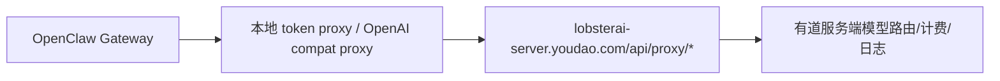

# TopVanAI 有道服务端依赖清单与切断方案

> 生成日期: 2026-06-19  
> 目标: 为“切断项目与有道服务端联系”的二次开发提供源码级依赖清单、影响面判断和替换路径。  
> 结论先行: 当前项目和有道/网易服务端的联系不是单点依赖，而是覆盖了登录认证、订阅额度、服务端模型、媒体生成、语音识别、HTML 分享、自动更新、Skill/Kit/MCP 市场、门户页面、下载资源、部分 IM 能力和可选有道智云模型 Provider。

## 1. 依赖分级结论

| 等级 | 依赖类型 | 是否影响核心可用性 | 代表域名/接口 | 切断建议 |
|------|----------|-------------------|---------------|----------|
| P0 | TopVanAI 主业务服务 | 高 | `lobsterai-server.youdao.com` / `lobsterai-server.inner.youdao.com` | 必须替换为自有后端，或整体禁用登录、额度、服务端模型、媒体、ASR、分享 |
| P0 | 登录 Portal 与账号体系 | 高 | `lobsterai.youdao.com/portal#` | 若不保留云账号，改成本地模式或自有 OAuth |
| P0 | 服务端模型代理 | 高 | `/api/proxy/*` | 若要完全断开，必须移除 `lobsterai-server` Provider 或改成自有代理 |
| P1 | 媒体生成 / ASR / HTML 分享 | 中高 | `/api/media/*`, `/api/asr/*`, `/api/html-shares/*` | 可禁用，也可替换为自有服务 |
| P1 | Overmind 配置/市场/更新 | 中 | `api-overmind.youdao.com` | 改成本地静态 JSON、自有配置中心，或禁用在线市场/更新 |
| P1 | 下载资源和内置 Kit | 中 | `ydhardwarebusiness.nosdn.127.net`, `ydhardwarecommon.nosdn.127.net` | 改为内置资源或自有 CDN |
| P2 | 网易系 IM 能力 | 取决于是否保留 | `lbs.netease.im`, `open.popo.netease.com`, `claw.163.com` | 若只切有道可评估保留；若切网易系需移除/替换 |
| P2 | 文档、客服、隐私、下载页面 | 低中 | `lobsterai.youdao.com`, `c.youdao.com` | 替换为自有页面或移除入口 |
| P3 | 品牌/README/测试样例 | 低 | `netease-youdao`, `youdao.com` | 品牌清理即可，不一定是运行时连接 |

## 2. 中心端点配置

服务端地址的核心集中在:

- `src/main/libs/endpoints.ts`
- `src/renderer/services/endpoints.ts`

主进程端点:

```ts
getServerApiBaseUrl()
// test: https://lobsterai-server.inner.youdao.com
// prod: https://lobsterai-server.youdao.com

getUpdateCheckUrl()
getManualUpdateCheckUrl()
getFallbackDownloadUrl()
getSkillStoreUrl()
getKitStoreUrl()
getPortalTasksUrl()
```

渲染进程端点:

```ts
getUpdateCheckUrl()
getManualUpdateCheckUrl()
getFallbackDownloadUrl()
getSkillStoreUrl()
getKitStoreUrl()
getLoginOvermindUrl()
getPortalLoginUrl()
getPortalPricingUrl()
getPortalProfileUrl()
getPortalRechargeUrl()
getPortalInvitationUrl()
```

注意: 这里存在主进程和渲染进程两套端点文件。切断时不能只改一处，否则会出现“主进程不连了，但 UI 仍然打开有道 Portal / Overmind”的残留。

## 3. TopVanAI 主业务服务依赖

### 3.1 域名

| 环境 | 域名 |
|------|------|
| 测试模式 | `https://lobsterai-server.inner.youdao.com` |
| 生产模式 | `https://lobsterai-server.youdao.com` |

来源: `src/main/libs/endpoints.ts`

### 3.2 登录认证

调用点主要在 `src/main/main.ts`:

| 功能 | 接口 | 代码位置 | 说明 |
|------|------|----------|------|
| 打开登录 | `{serverBaseUrl}/login` 或 Portal URL | `auth:login` | 打开系统浏览器，附带 `source=electron`、本地 callback 或 deep link |
| 换 token | `POST /api/auth/exchange` | `auth:exchange` | 用 authCode 换 `accessToken` / `refreshToken` / user / quota |
| 刷新 token | `POST /api/auth/refresh` | `refreshOnce()` | 401 后被动刷新，也有主动刷新 |
| 退出登录 | `POST /api/auth/logout` | `auth:logout` | best-effort 调用，失败不阻塞本地清理 |

影响:

- 不替换这组接口，当前云账号登录体系无法工作。
- `fetchWithAuth()` 会给所有主业务 API 附加 `Authorization: Bearer <accessToken>`。
- OpenClaw 的 `lobsterai-server` 模型代理也依赖同一套 token。

切断方案:

1. 如果目标是完全本地化: 增加“本地免登录模式”，让 `authSlice` 可以进入本地可用状态，并绕过 quota/server model 拉取。
2. 如果目标是替换成自有云: 保留接口语义，搭建兼容 `/api/auth/exchange`、`/api/auth/refresh`、`/api/auth/logout` 的后端。
3. 如果目标是用户自带 API Key: 移除 `lobsterai-server` Provider 默认入口，引导用户配置 OpenAI/Anthropic/Qwen/DeepSeek 等自有 Provider。

### 3.3 用户资料、额度、订阅状态

调用点:

| 功能 | 接口 | 代码位置 |
|------|------|----------|
| 用户资料 | `GET /api/user/profile` | `src/main/main.ts` `auth:getUser` |
| 用户额度 | `GET /api/user/quota` | `auth:getUser`, `auth:getQuota`, `startupCacheWarmup.ts` |
| 用户摘要 | `GET /api/user/profile-summary` | `auth:getProfileSummary` |

影响:

- UI 登录态、用户资料、套餐/余额/免费额度提示依赖这些接口。
- `startupCacheWarmup.ts` 启动时预热 quota 和模型列表，用于减少 OpenClaw 启动阶段重复同步。
- 媒体生成权限、服务端模型可用性也会受 quota 状态影响。

切断方案:

- 本地化时应定义一个本地 quota 默认值，例如无限制或仅隐藏云功能。
- 如果保留付费/订阅，需要自有服务返回兼容字段。
- 需要检查 `normalizeQuota()`、`authQuotaGateStateFromQuota()` 相关逻辑，避免没有云端 quota 时误判为不可用。

### 3.4 模型列表与价格目录

调用点:

| 功能 | 接口 | 代码位置 |
|------|------|----------|
| 公开价格目录 | `GET /api/models/pricing-catalog` | `src/main/main.ts` `AuthIpcChannel.GetPricingCatalog` |
| 当前用户可用模型 | `GET /api/models/available` | `src/main/main.ts` `auth:getModels`, `startupCacheWarmup.ts` |
| 渲染进程落库 | server models 写入 Redux | `src/renderer/services/auth.ts` |

关键点:

- 渲染进程把服务端返回模型标记为 `providerKey: 'lobsterai-server'`。
- 多处测试和模型选择逻辑使用 `lobsterai-server/<modelId>` 形式。
- 当前示例中可见内部模型名如 `qwen3.6-plus-YoudaoInner`、`MiniMax-M2.7-YoudaoInner`，这属于明显有道内部模型痕迹。

切断方案:

- 若完全去有道: 删除或隐藏 `lobsterai-server` Provider，服务端模型列表为空时 UI 不应报错。
- 若替换为自有服务: 可以继续使用 `lobsterai-server` 这个内部 Provider Key，但建议重命名为中性名称，例如 `cloud-server`，并同步修改类型、测试和 OpenClaw 配置映射。
- 注意 `src/main/libs/openclawAgentModels.ts`、`src/main/libs/openclawConfigSync.ts`、`src/main/libs/claudeSettings.ts` 都会处理服务端模型。

## 4. OpenClaw 服务端模型代理

### 4.1 本地代理到有道服务

关键文件:

- `src/main/libs/openclawTokenProxy.ts`
- `src/main/libs/claudeSettings.ts`
- `src/main/libs/coworkOpenAICompatProxy.ts`
- `src/main/libs/openclawConfigSync.ts`

数据流:



源码证据:

- `openclawTokenProxy.ts` 将 OpenClaw 请求路径拼成 `/api/proxy${req.url}`。
- `claudeSettings.ts` 在匹配 `lobsterai-server` Provider 时生成 `${serverBaseUrl}/api/proxy/v1`。
- `coworkOpenAICompatProxy.ts` 对 `provider === 'lobsterai-server'` 额外注入 `session_id` 和 `user_message`，注释明确写着用于 `lobsterai-server logging only`。

影响:

- 即使你在 UI 层不主动点登录，只要 Cowork 默认模型落到 `lobsterai-server`，就会产生到有道主服务的模型调用。
- 该链路还与 token 刷新、quota、模型列表、OpenClaw 配置同步耦合。

切断方案:

1. 默认 Provider 改为用户自配模型，而不是 `lobsterai-server`。
2. 移除 `tryLobsteraiServerFallback()` 这类自动 fallback，避免用户配置缺失时悄悄回落到有道服务端。
3. OpenClaw 配置生成时不要生成 `lobsterai-server` provider。
4. 如果保留云代理能力，应改为自有域名和自有 token 体系。

## 5. 媒体生成服务依赖

调用点主要在 `src/main/main.ts` 和 `openclaw-extensions/lobster-media-generation`。

| 功能 | 接口 | 说明 |
|------|------|------|
| 图片模型列表 | `GET /api/media/images/models` | UI 与 OpenClaw 工具都可能触发 |
| 视频模型列表 | `GET /api/media/videos/models` | 同上 |
| 图片生成 | `POST /api/media/images/generate` | 需要登录 token 和额度 |
| 视频生成 | `POST /api/media/videos/generate` | 带成本/时长确认逻辑 |
| 任务状态 | `GET /api/media/{images|videos}/tasks/{taskId}` | 轮询生成进度 |
| 取消视频任务 | `POST /api/media/videos/tasks/{taskId}/cancel` | Cowork 里也有取消入口 |

OpenClaw 扩展:

- `openclaw-extensions/lobster-media-generation/index.ts`
- 工具名: `lobsterai_image_generate`, `lobsterai_video_generate`
- 扩展本身调用本地 callback，真正的服务端请求在主进程 callback 里完成。

影响:

- 如果切断有道服务端，媒体生成工具应禁用，否则 Agent 会调用一个不可用工具。
- UI 中的媒体模型选择器、额度提示、任务轮询都要同步处理。

切断方案:

- 快速禁用: 不注册 `lobster-media-generation` OpenClaw 扩展，隐藏媒体生成入口。
- 替换服务: 自建 `/api/media/*` 兼容服务，或把工具改为直接调用你选定的图片/视频 Provider。
- 去品牌化: 工具名中的 `lobsterai_*` 可保留为内部名，但若目标是彻底白标，建议重命名并做兼容迁移。

## 6. 实时语音识别 ASR 依赖

关键文件:

- `src/main/ipcHandlers/asr/handlers.ts`
- `src/renderer/services/voiceInput/realtimeAsrClient.ts`

流程:

1. 主进程调用 `{serverBaseUrl}/api/asr/realtime/sessions` 创建 ASR session。
2. 服务端返回 `wsUrl`、`requestId`、额度等。
3. 渲染进程用浏览器 `WebSocket` 直连 `wsUrl`，发送 PCM/WAV 音频块。

影响:

- 这不是单纯 HTTP 依赖，还包含服务端下发的 WebSocket 地址。
- 如果不替换，语音输入/实时转写能力不可用。

切断方案:

- 禁用语音输入入口。
- 替换为本地 ASR，例如 Whisper/Paraformer 本地推理。
- 替换为自有 ASR 后端，并保持 `/api/asr/realtime/sessions` 响应结构兼容。

## 7. HTML / Artifact 分享服务依赖

关键文件:

- `src/main/libs/htmlShare/htmlShareClient.ts`
- `src/main/main.ts` 中 `htmlShare:*` IPC
- `docs/server-integration/*html-share*`

接口:

| 功能 | 接口 |
|------|------|
| 创建分享 | `POST /api/html-shares` |
| 更新分享内容 | `PUT /api/html-shares/{shareId}` |
| 开关状态 | `PATCH /api/html-shares/{shareId}/status` |
| 修改访问模式 | `PUT /api/html-shares/{shareId}/access-mode` |
| 按来源查询 | `GET /api/html-shares/source?...` |
| 我的分享列表 | `GET /api/html-shares/my` |
| 公开访问 | `{serverBaseUrl}/s/{shareId}/` |

影响:

- Artifacts 的在线分享能力完全依赖有道服务端。
- 文档显示服务端还做内容审核、分享码、活跃分享数量限制等。

切断方案:

- 禁用“分享”按钮，仅保留本地预览/导出。
- 自建分享服务，兼容上述接口。
- 若保留公开分享，需要同步替换 `getHtmlSharePublicBaseUrl()`。

## 8. Overmind 配置、市场和更新依赖

域名:

- `https://api-overmind.youdao.com/openapi/get/luna/hardware/lobsterai/...`

用途:

| 功能 | prod path | test path | 代码位置 |
|------|-----------|-----------|----------|
| 自动更新 | `prod/update` | `test/update` | `src/main/libs/endpoints.ts`, `src/main/libs/appUpdateCoordinator.ts` |
| 手动更新 | `prod/update-manual` | `test/update-manual` | 同上 |
| Skill 商店 | `prod/skill-store` | `test/skill-store` | `src/main/ipcHandlers/skills/handlers.ts` |
| Kit 商店 | `prod/kit-store` | `test/kit-store` | `src/main/ipcHandlers/kits/handlers.ts` |
| MCP 市场 | `prod/mcp-marketplace` | `test/mcp-marketplace` | `src/main/ipcHandlers/mcp/handlers.ts` |
| 登录 URL | `prod/login-url` | `test/login-url` | `src/renderer/services/auth.ts` |

影响:

- 自动更新会向有道 Overmind 拉取更新 JSON，并可能使用其返回的安装包 URL。
- Skill/Kits/MCP 市场会从有道配置中心拉远程目录。
- 登录 URL 会先从 Overmind 获取，失败才 fallback 到 Portal 登录页。

切断方案:

1. 自动更新: 替换为 GitHub Releases、自有更新服务，或禁用更新检查。
2. Skill/Kits/MCP 市场: 改成本地静态 JSON，或自建 marketplace。
3. 登录 URL: 删除 Overmind 获取逻辑，直接使用自有 Portal 或本地登录模式。
4. 建议新增统一 `RemoteCatalogProvider` 抽象，避免未来再散落硬编码。

## 9. Portal、文档、隐私和升级页面

域名:

- `https://lobsterai.youdao.com/portal#`
- `https://lobsterai.inner.youdao.com/portal#`
- `https://lobsterai.youdao.com/#/docs/...`
- `https://lobsterai.youdao.com/#/about`
- `https://c.youdao.com/dict/hardware/lobsterai/lobsterai_service.html`

代码位置:

- `src/renderer/services/endpoints.ts`
- `src/main/libs/endpoints.ts`
- `src/renderer/components/LoginButton.tsx`
- `src/renderer/components/Settings.tsx`
- `src/renderer/components/PrivacyDialog.tsx`
- `src/shared/platform/constants.ts`
- `src/main/i18n.ts`
- `src/renderer/services/i18n.ts`

影响:

- 登录、充值、套餐升级、邀请、任务页、用户手册、社群、IM 配置教程、隐私服务协议都会打开有道页面。
- 这些不一定阻塞本地核心运行，但属于显性品牌和外部连接。

切断方案:

- 将 Portal 函数全部替换为自有站点。
- 隐私协议和用户手册改为自有页面或内置 Markdown。
- `src/shared/platform/constants.ts` 里的 IM 配置指南 URL 应改为自有文档或置空。
- i18n 文案中的“立即升级”链接要同步替换。

## 10. 有道智云 Provider 依赖

关键文件:

- `src/shared/providers/constants.ts`
- `src/renderer/components/icons/providers/YouDaoZhiYunIcon.tsx`

配置:

```ts
ProviderName.Youdaozhiyun
label: 'Youdao'
website: 'https://ai.youdao.com'
apiKeyUrl: 'https://ai.youdao.com/console'
defaultBaseUrl: 'https://openapi.youdao.com/llmgateway/api/v1/chat/completions'
```

判断:

- 这是一个用户可选 LLM Provider，不等同于 TopVanAI 主业务服务。
- 如果用户手动启用并填写 API Key，才会连接 `openapi.youdao.com`。
- 如果目标是“完全去有道”，应删除该 Provider、图标、i18n、默认配置和测试。

## 11. 网易系 IM / 邮件 / POPO / 云信依赖

这部分需要区分“切断有道”还是“切断网易系”。如果你的目标是完全摆脱网易/有道生态，这些也要处理。

| 能力 | 域名/服务 | 代码位置 | 说明 |
|------|-----------|----------|------|
| NIM QR 登录 | `https://lbs.netease.im` | `src/shared/im/nimQrLogin.ts`, `src/main/im/nimQrLoginService.ts` | 生成/轮询云信二维码 |
| POPO 任务页 | `https://f2e.popo.netease.com/...` | `src/main/im/imGatewayManager.ts` | POPO 任务 H5 |
| POPO polling/completed | `https://open.popo.netease.com/open-apis/no-auth/openclaw/v1/*` | `src/main/im/imGatewayManager.ts` | POPO webhook/轮询流程 |
| 邮件 IM Token | `https://claw.163.com/claw-api-gateway/open/v1/mail/auth/im-token` | `src/main/im/imGatewayManager.ts` | WebSocket 邮件模式 token 校验 |
| API Key 控制台 | `https://claw.163.com/projects/dashboard/?channel=TopVanAI#/api-keys` | `src/renderer/components/im/IMSettings.tsx` | UI 引导链接 |
| Netease Bee | `openclaw-netease-bee` | `package.json`, IM 配置 | OpenClaw 插件形式接入 |
| NIM Channel | `github.com/netease-im/openclaw-nim-channel.git#1.1.1` | `package.json` | 插件依赖 |

切断方案:

- 如果只做白标但保留 IM 能力: 可以暂时保留第三方/网易 IM，替换文案和文档。
- 如果完全去网易: 移除 `netease-im`、`netease-bee`、`popo` 相关平台、配置、插件、UI 和测试。
- 邮件 WebSocket 模式若依赖 `claw.163.com`，应改为 IMAP/SMTP 本地直连或自建 token 服务。

## 12. 下载资源、CDN 和内置 Computer Use

关键文件:

- `src/main/computerUse/computerUseRuntime.ts`
- `src/shared/computerUse/constants.ts`
- `src/main/computerUse/computerUseKit.ts`
- `src/renderer/components/im/constants.ts`
- README 中的社群二维码

资源:

| 用途 | URL |
|------|-----|
| Computer Use runtime | `https://ydhardwarebusiness.nosdn.127.net/806b908f1ba20905cc5c99495bccc69c.zip` |
| Computer Use Kit bundle | `https://ydhardwarebusiness.nosdn.127.net/2fa564627a3f1a0f3acedbc771d15f12.zip` |
| Computer Use Kit 图标 | `https://ydhardwarecommon.nosdn.127.net/f02f8c2d2af8b1f88426327944f6e1f5.png` |
| README 微信社群二维码 | `https://shared.ydstatic.com/.../wechat_group-*.png` |
| 云信客户端下载图 | `https://yx-web-nosdn.netease.im/...` |

影响:

- Computer Use runtime 如果本地不存在，会从有道 NOS CDN 下载。
- 内置 Kit bundle 也指向有道 CDN。
- 图标和 README 资源属于低风险外链，但白标发布需要替换。

切断方案:

- 将 runtime 和 kit bundle 纳入安装包，或改为自有 CDN。
- 保持 SHA256 校验更新，避免只改 URL 不改校验值。
- UI 图标建议本地化到 `src/renderer/assets`。

## 13. 构建、包和仓库层面的网易/有道痕迹

| 类型 | 位置 | 说明 |
|------|------|------|
| 作者邮箱 | `package.json` | `lobsterai.project@rd.netease.com` |
| 私有 npm registry | `package.json` OpenClaw plugin 配置 | `https://npm.nie.netease.com` |
| Netease 插件 | `package.json` | `openclaw-nim-channel`, `openclaw-netease-bee` |
| GitHub 仓库 | README | `github.com/netease-youdao/TopVanAI` |
| License | `LICENSE` | `Copyright (c) 2026 TopVan` |
| 打包目录名 | `electron-builder.json` | `Resources/cfmind` 是打包资源目录名，不是服务端连接 |

判断:

- 这些多数不是运行时网络连接，但会影响白标、合规和构建可复现。
- `npm.nie.netease.com` 如果构建阶段需要拉插件包，就属于构建时服务依赖。

## 14. 建议切断路线

### 阶段 1: 建立可观测清单

先不要急着删除功能，建议先加一个“禁止有道域名”的运行时检测或网络代理审计，确认哪些路径在实际使用中会触发。

建议扫描命令:

```powershell
rg -n "youdao|netease|163\\.com|127\\.net|ydstatic|nosdn|api-overmind|lobsterai-server|openapi\\.youdao|claw\\.163|popo\\.netease|lbs\\.netease" src openclaw-extensions scripts package.json README.md README_zh.md -g '!**/*.map' -g '!**/node_modules/**'
```

### 阶段 2: 抽象端点

新增一个统一的端点配置层，建议至少包含:

```ts
type RemoteServicesConfig = {
  serverApiBaseUrl?: string;
  portalBaseUrl?: string;
  updateCheckUrl?: string;
  manualUpdateCheckUrl?: string;
  skillStoreUrl?: string;
  kitStoreUrl?: string;
  mcpMarketplaceUrl?: string;
  computerUseRuntimeUrl?: string;
  computerUseKitBundleUrl?: string;
};
```

不要继续让主进程和渲染进程各自硬编码一套有道 URL。

### 阶段 3: 先断主业务服务

优先处理:

1. `getServerApiBaseUrl()`
2. 登录认证 `/api/auth/*`
3. `lobsterai-server` Provider
4. `/api/proxy/*`
5. `/api/models/available`
6. `/api/user/quota`

这是决定 Cowork 是否还会连有道模型服务的关键路径。

### 阶段 4: 处理可选云能力

可按业务决定禁用或替换:

- 媒体生成 `/api/media/*`
- ASR `/api/asr/realtime/sessions`
- HTML 分享 `/api/html-shares/*`
- Skill/Kits/MCP 市场
- 自动更新

### 阶段 5: 去品牌和资源本地化

最后处理:

- README / LICENSE / package author
- Portal 文档链接
- 隐私协议
- 有道智云 Provider
- NOS / ydstatic / Netease IM 图片资源
- `netease-youdao` GitHub 链接

## 15. 风险清单

| 风险 | 说明 | 建议 |
|------|------|------|
| 默认模型回退到 `lobsterai-server` | 用户未配置 API Key 时，某些路径会 fallback 到服务端模型 | 移除 fallback 或改为显式报错 |
| token 刷新和 OpenClaw 配置耦合 | token 更新会触发 OpenClaw config sync | 本地模式下要禁用这条同步副作用 |
| 媒体工具仍被 Agent 调用 | UI 隐藏不等于 OpenClaw 工具未注册 | 同时处理 `openclaw-extensions/lobster-media-generation` |
| ASR WebSocket 地址由服务端返回 | 仅替换 HTTP 入口不够 | 自有 ASR 需要返回兼容 `wsUrl` |
| HTML 分享有服务端审核/限额语义 | 客户端文档和状态机已经假设服务端行为 | 自建服务要兼容状态码和字段 |
| 市场数据影响 Skill/Kit 显示 | 远程 marketplace 还承担描述、标签、版本信息 | 本地 JSON 要覆盖这些字段 |
| 构建阶段仍访问网易 registry/CDN | 运行时断开不代表构建断开 | 离线化构建依赖和资源 |

## 16. 最小可行去有道方案

如果你的第一目标是“启动后不主动连接有道服务端”，最小改造面建议是:

1. 默认关闭自动更新检查，或改为本地 no-op。
2. 禁用登录入口和 Portal 链接，进入本地模式。
3. 默认不加载 `lobsterai-server` 模型，不调用 `/api/models/available`。
4. 移除 `tryLobsteraiServerFallback()` 自动回退。
5. OpenClaw 配置生成时只写用户配置的第三方 Provider。
6. 禁用媒体生成、ASR、HTML 分享、Skill/Kits/MCP 在线市场。
7. Computer Use runtime 改为本地随包资源。
8. 用扫描命令确认无有道/网易域名残留在运行时路径。

完成以上之后，项目仍可保留:

- Electron + React 桌面壳
- OpenClaw 本地 Agent Runtime
- 用户自配模型 Provider
- 本地 SQLite 会话/记忆
- 本地 Artifacts 预览
- 本地 Skills

也就是说，切断有道服务端不是要推倒整个项目；真正要重构的是“云账号 + 云模型 + 云能力 + 在线市场/更新”这一层。
