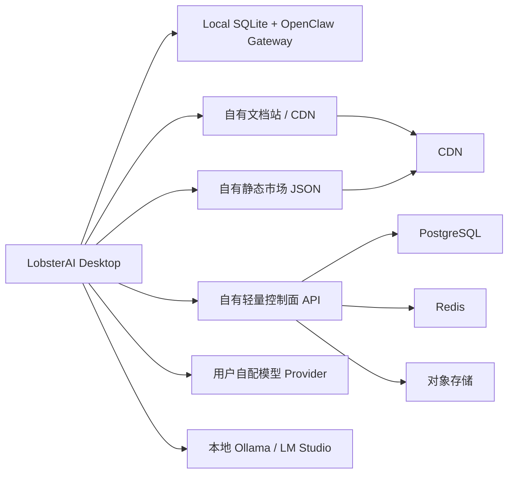

# 方案 A：自建轻量服务开发计划

> 生成日期: 2026-06-19  
> 目标: 在不自建大模型推理、不自建图片/视频生成、不自建实时 ASR 的前提下，替换 LobsterAI 对有道网页和云服务的依赖，让产品进入“本地可用 + 用户自配模型 / 本地模型 + 自有轻量控制面”的可交付状态。  
> 适用规模: 约 1000 个注册客户，100-300 日活，20-150 同时在线/同时运行任务的早期商业化规模。

## 1. 方案 A 的边界

方案 A 的核心判断是：LobsterAI 的 Agent 执行主链路并不必然需要云端运行。Electron 主进程、本地 SQLite、OpenClaw Gateway、用户自配 Provider、本地 Skills、Artifacts 预览都可以继续在用户机器上工作。服务端只承担轻量控制面和公共资源能力。

### 1.1 方案 A 要替代的内容

| 类型 | 现有有道依赖 | 方案 A 替代方式 |
|------|--------------|-----------------|
| 文档站 | `lobsterai.youdao.com/#/docs/*` | 自有文档站，内容来自 `docs_youdao_manual/` 或二次整理文档 |
| 下载页 | `lobsterai.youdao.com/#/download-list` | 自有下载页 + 自有 CDN / 对象存储 |
| 登录 Portal | `lobsterai.youdao.com/portal#` | 自有账号页，或客户端本地免登录模式 |
| 用户资料 | `/api/user/profile` | 自有用户表，或本地模式返回匿名用户 |
| 订阅/额度展示 | `/api/user/quota`, `/api/user/profile-summary` | 自有套餐字段，方案 A 不用于云模型计费 |
| 模型列表 | `/api/models/available`, `/api/models/pricing-catalog` | 不再返回有道云模型；仅提供 Provider 配置指引 |
| Skill / Kit / MCP 市场 | Overmind JSON | 自有静态 JSON 或本地内置目录 |
| 自动更新 | Overmind update JSON | 自有更新 JSON 或暂时关闭 |
| HTML 分享 | `/api/html-shares/*` | 可选自建分享服务；第一阶段可禁用 |
| 服务协议/隐私 | `c.youdao.com` | 自有静态页面 |

### 1.2 方案 A 明确不做的内容

| 不做项 | 原因 | 处理方式 |
|--------|------|----------|
| 自建 LLM 推理 | GPU 成本和工程复杂度高，且当前文档已支持用户配置 OpenAI / Anthropic / DeepSeek / Qwen / Ollama | 用户自带 API Key 或使用本地 Ollama / LM Studio |
| 自建云模型代理 | 方案 A 不做 token 计费和模型转发，避免代理成本和合规风险 | 客户端直接调用用户配置的第三方 Provider |
| 自建图片/视频生成 | GPU 和任务队列成本高 | 禁用 `lobster-media-generation` 或保留为用户自行配置的未来能力 |
| 自建实时 ASR | WebSocket + 音频推理链路复杂 | 禁用语音输入，或未来接第三方 ASR |
| 完整付费订阅系统 | 方案 A 先以产品交付和私有化部署为目标 | 可只保留 license / seat 管理 |

## 2. 现有源码影响面

### 2.1 端点配置

主进程和渲染进程各有一套硬编码端点：

- `src/main/libs/endpoints.ts`
- `src/renderer/services/endpoints.ts`

其中主进程 `getServerApiBaseUrl()` 当前在测试/生产之间返回：

- `https://lobsterai-server.inner.youdao.com`
- `https://lobsterai-server.youdao.com`

渲染进程还单独维护 Portal、Overmind、下载页、Skill Store、Kit Store URL。方案 A 的第一件事不是改散落调用点，而是建立统一的 `RemoteServicesConfig`，让主进程和渲染进程从同一份配置派生端点。

### 2.2 服务端模型依赖

现有服务端模型通过 `providerKey: 'lobsterai-server'` 进入渲染进程状态。关键路径包括：

- `src/renderer/services/auth.ts` 的 `loadServerModels()`
- `src/main/libs/claudeSettings.ts` 的 `tryLobsteraiServerFallback()`
- `src/main/libs/startupCacheWarmup.ts` 的 `/api/user/quota` 与 `/api/models/available` 预热
- `src/main/libs/openclawTokenProxy.ts` 的 `/api/proxy/*`
- `src/main/libs/coworkOpenAICompatProxy.ts` 对 `lobsterai-server` 的特殊日志字段注入

方案 A 必须让客户端在没有 `lobsterai-server` 的情况下仍然可启动、可进入 Cowork、可生成 OpenClaw 配置。不能只隐藏登录按钮，否则 OpenClaw 配置同步仍可能回退到有道模型。

### 2.3 可禁用云能力

以下能力建议在方案 A 第一阶段禁用，后续再按商业需求恢复：

- 媒体生成：`/api/media/*`
- 实时 ASR：`/api/asr/realtime/sessions`
- HTML 分享：`/api/html-shares/*`
- 在线 Skill / Kit / MCP 市场写入安装
- 自动更新强提示

禁用要同时覆盖 UI 入口、IPC handler、OpenClaw 扩展注册和错误提示。只在 UI 隐藏按钮不够，Agent 仍可能从工具注册表调用云工具。

## 3. 目标架构



服务端只处理低频控制面请求。高成本的 LLM token、GPU 推理和长时 Agent 执行不进入自有服务器。

## 3.1 结合 `E:\code\venusAI_Server` 后的修订判断

`E:\code\venusAI_Server` 已经实现了一套 LobsterAI 兼容后端雏形。它不是纯粹的方案 A，而是“方案 A + 极简方案 B 过渡层”：

- 方案 A 部分：认证、用户资料、quota、模型目录、简单 Portal 页面。
- 方案 B 雏形：`/api/proxy/v1/chat/completions` 统一转发到 DeepSeek，上游 API Key 存在服务端。

这对开发有两个好处：

1. 客户端短期可以少改。只要把 `getServerApiBaseUrl()` 配置到 VenusAI Server，就可以复用现有 LobsterAI 的 auth、server model、OpenClaw token proxy 路径。
2. 后端接口契约已经初步对齐。现有 OpenClaw token proxy 会把 `/v1/chat/completions` 转到 `/api/proxy/v1/chat/completions`，VenusAI Server 正好实现了这个接口。

但它也意味着容量和产品策略要分两档：

| 模式 | 描述 | 服务器压力 | 适用阶段 |
|------|------|------------|----------|
| 纯方案 A / BYOK | 用户 API Key 保存在本机，服务端不转发模型请求 | 很低 | 最安全、最低成本、优先目标 |
| VenusAI 代理模式 | 服务端保存 DeepSeek 等上游 Key，统一代理模型请求 | 中等，受流式连接和上游限流影响 | 过渡阶段或统一采购模型额度 |

如果目标严格是方案 A，VenusAI Server 的 `/api/proxy/*` 应作为可选功能关闭，默认返回空 server models；如果目标是快速复刻有道体验，可以保留代理模式，但它会引入模型成本、限流、审计和合规问题。

## 3.2 `venusAI_Server` 现状审计

### 3.2.1 项目结构

路径：`E:\code\venusAI_Server`

| 文件 | 职责 |
|------|------|
| `src/server.js` | Node 原生 HTTP 入口，路由所有 auth、user、models、proxy、Portal 页面 |
| `src/config.js` | 从环境变量读取端口、JWT 密钥、DeepSeek Key、用户资料、quota、模型目录 |
| `src/tokens.js` | 无依赖 HMAC JWT-like access/refresh token |
| `src/authCodes.js` | 内存一次性 auth code，用于浏览器登录回调 |
| `src/models.js` | 默认 DeepSeek 模型目录与 pricing catalog 转换 |
| `src/proxy.js` | `/api/proxy/*` 到 DeepSeek OpenAI-compatible API 的流式转发 |
| `src/loginPage.js` | 简单网页登录页 |
| `src/http.js` | JSON、HTML、CORS、表单读取等 HTTP 工具 |
| `test/*.test.js` | token 与 model catalog 单元测试 |

现有测试结果：

```text
npm test
4 tests passed
```

### 3.2.2 已实现接口

| 接口 | 状态 | 备注 |
|------|------|------|
| `GET /health` | 已实现 | 返回状态和模型数量 |
| `GET /login` / `POST /login` | 已实现 | 生成一次性 auth code 并跳回客户端 callback |
| `POST /api/auth/exchange` | 已实现 | code 换 access/refresh token |
| `POST /api/auth/refresh` | 已实现 | refresh token 滚动签发 |
| `POST /api/auth/logout` | 已实现 | 只把当前 token 加入内存撤销集合 |
| `GET /api/user/profile` | 已实现 | 需要 access token |
| `GET /api/user/quota` | 已实现 | 返回 env 配置的固定 quota |
| `GET /api/user/profile-summary` | 已实现 | 返回 credits breakdown |
| `GET /api/models/available` | 已实现 | 默认返回 DeepSeek Chat / Reasoner |
| `GET /api/models/pricing-catalog` | 已实现 | 返回 textModels，image/video 为空 |
| `POST /api/proxy/v1/chat/completions` | 已实现 | 转发到 `${DEEPSEEK_BASE_URL}/v1/chat/completions` |
| `/profile`、`/pricing`、`/invitation` | 已实现 | 简易 HTML Portal 页面 |

### 3.2.3 可直接复用点

1. **接口路径契约**：与 LobsterAI 当前主服务路径基本一致，可作为客户端改造的联调目标。
2. **模型目录结构**：`modelId`、`modelName`、`provider`、`apiFormat`、`supportsThinking` 等字段与客户端 `loadServerModels()` 期望接近。
3. **流式代理**：`proxy.js` 不缓冲上游响应，适合 OpenAI-compatible SSE。
4. **环境变量模型目录**：`MODEL_CATALOG_JSON` 允许快速扩展其他 OpenAI-compatible 模型。
5. **无外部依赖**：方便在客户机器或内网先跑通。

### 3.2.4 生产化缺口

| 缺口 | 当前状态 | 1000 客户风险 |
|------|----------|---------------|
| 数据库 | 无，用户和 quota 都来自 env | 无法多用户、多组织、审计、封禁 |
| Token 撤销 | 内存 Set | 服务重启后失效，多实例不共享 |
| Auth code | 内存 Map | 多实例下 callback 可能落到另一台机器 |
| 用户体系 | 单用户 env | 无法承接 1000 客户 |
| 密码/SSO | 无真实账号验证 | 只适合开发或单租户私有部署 |
| 限流 | 无 | 代理模式下容易被滥用或打穿上游额度 |
| 模型成本统计 | 无 | 无法知道客户消耗和上游成本 |
| 上游多 Provider | 仅 DeepSeek | 无法按模型动态路由 |
| HTML 分享 | 未实现 | Artifacts 分享仍需禁用 |
| ASR / 媒体生成 | 未实现 | 相关入口仍需禁用 |
| Skill/Kit/MCP 市场 | 未实现 | 需静态 JSON 或新接口 |
| 更新服务 | 未实现 | 需静态 update JSON |
| 部署安全 | CORS `*`，无 TLS，由外部提供 | 生产必须加反代、HTTPS、CORS 白名单 |
| 日志与监控 | console log | 缺少指标、告警、请求追踪 |

### 3.2.5 对原方案 A 的调整

原方案 A 建议完全不代理模型。结合现有 `venusAI_Server`，推荐拆成两个 profile：

#### Profile 1：Local BYOK（默认）

- `GET /api/models/available` 返回空数组。
- 客户端只使用用户本机配置的 Provider。
- `/api/proxy/*` 默认关闭。
- 服务器只做文档、登录、license、配置、市场 JSON。

这是最符合方案 A 的低成本路线。

#### Profile 2：Managed DeepSeek（可选）

- `GET /api/models/available` 返回 VenusAI Server 的 DeepSeek 模型。
- OpenClaw 通过 `/api/proxy/v1/chat/completions` 走服务端统一 DeepSeek Key。
- 需要限流、用量统计、成本上限、组织级 quota。

这是快速兼容现有 `lobsterai-server` 体验的过渡路线，不建议在没有成本控制前开放给 1000 客户。

## 4. 服务端功能清单

### 4.1 必做服务

| 模块 | 说明 | 优先级 |
|------|------|--------|
| 用户账号 | 邮箱/手机号/企业账号登录，发放 access token / refresh token | P0 |
| 本地模式兼容 API | 未登录也能返回客户端需要的本地默认状态 | P0 |
| Provider 指引配置 | 返回支持的第三方 Provider、默认 base URL、文档链接 | P0 |
| 文档站 | 承接用户手册、模型配置、IM 配置、开发者文档 | P0 |
| 下载页与版本清单 | 提供 Windows/macOS 安装包入口和版本说明 | P0 |
| 远程配置 JSON | Skill Store、Kit Store、MCP Marketplace、更新检查 | P1 |
| License / Seat 管理 | 1000 客户场景建议至少有 seat / organization 表 | P1 |
| 反馈与日志上传 | 可选，用于排障；注意用户隐私和脱敏 | P2 |

### 4.2 可选服务

| 模块 | 说明 | 建议 |
|------|------|------|
| HTML 分享 | 用户将 Artifact 发布为公开链接 | 第二阶段做，第一阶段可禁用 |
| 企业 SSO | 企业客户接入 OIDC / SAML | 有企业客户后做 |
| 远程策略 | 管理是否允许某些 Provider、是否启用 IM | 私有化部署后做 |
| 插件市场后台 | 管理 Skill/Kit/MCP 元数据 | 初期用静态 JSON 即可 |

## 5. 推荐 API 设计

### 5.1 认证接口

保持客户端容易迁移，建议兼容现有语义，但不必兼容有道 Portal 的所有字段。

```http
POST /api/auth/login
POST /api/auth/exchange
POST /api/auth/refresh
POST /api/auth/logout
GET  /api/auth/me
```

本地免登录模式下，客户端应完全绕过 `exchange`，直接进入 `local` auth state。若仍需调用服务端，可返回匿名用户：

```json
{
  "code": 0,
  "data": {
    "user": {
      "id": "local-user",
      "name": "Local User",
      "plan": "local"
    }
  }
}
```

### 5.2 用户与套餐接口

```http
GET /api/user/profile
GET /api/user/quota
GET /api/user/profile-summary
```

方案 A 的 quota 只用于 UI 展示和功能开关，不用于云模型计费。建议返回：

```json
{
  "code": 0,
  "data": {
    "subscriptionStatus": "local",
    "mediaGenerationEntitled": false,
    "serverModelEntitled": false,
    "htmlShareEntitled": false
  }
}
```

### 5.3 模型接口

```http
GET /api/models/available
GET /api/models/pricing-catalog
GET /api/providers/catalog
```

方案 A 中 `/api/models/available` 默认返回空数组，避免生成 `lobsterai-server` 模型：

```json
{
  "code": 0,
  "data": []
}
```

新增 `/api/providers/catalog` 用于返回第三方 Provider 配置建议，例如 OpenAI、Anthropic、DeepSeek、Qwen、Moonshot、Ollama、LM Studio。客户端仍由用户自行填写 API Key。

### 5.4 静态市场与更新接口

初期可以全部是静态 JSON：

```http
GET /catalog/update.json
GET /catalog/update-manual.json
GET /catalog/skill-store.json
GET /catalog/kit-store.json
GET /catalog/mcp-marketplace.json
```

这些 JSON 可以部署在对象存储 + CDN，不一定进入业务 API 服务。

### 5.5 HTML 分享接口（第二阶段）

若恢复 Artifact 分享，建议兼容现有接口：

```http
POST  /api/html-shares
PUT   /api/html-shares/{shareId}
PATCH /api/html-shares/{shareId}/status
PUT   /api/html-shares/{shareId}/access-mode
GET   /api/html-shares/source
GET   /api/html-shares/my
GET   /s/{shareId}/
```

第一阶段可以在客户端禁用分享按钮，并让相关 IPC 返回明确错误：`HTML_SHARE_DISABLED_IN_LOCAL_MODE`。

## 6. 客户端改造计划

### 6.1 端点配置统一

新增共享配置：

```ts
type RemoteServicesConfig = {
  mode: 'local' | 'selfHosted';
  serverApiBaseUrl?: string;
  portalBaseUrl?: string;
  docsBaseUrl?: string;
  downloadBaseUrl?: string;
  updateCheckUrl?: string;
  manualUpdateCheckUrl?: string;
  skillStoreUrl?: string;
  kitStoreUrl?: string;
  mcpMarketplaceUrl?: string;
  htmlSharePublicBaseUrl?: string;
};
```

任务：

1. 新增 `src/shared/remoteServices/constants.ts` 和类型定义。
2. 主进程 `src/main/libs/endpoints.ts` 改为读取统一配置。
3. 渲染进程 `src/renderer/services/endpoints.ts` 改为读取同一配置快照。
4. 添加默认 `local` 配置，禁止默认回落到有道 URL。
5. 增加测试，验证生产模式下不会出现 `youdao.com`、`netease.com`、`127.net` 默认端点。

验收：

- 全局搜索运行时端点，不再有默认有道域名。
- 修改服务端 Base URL 只需改一处配置。

### 6.2 本地免登录模式

任务：

1. 在 auth 状态中增加 `mode: 'local' | 'cloud'`。
2. 首次启动允许用户选择“本地使用，不登录”。
3. 本地模式下跳过 Portal 登录、token exchange、token refresh。
4. 本地模式下 `auth:getUser` 返回本地用户对象。
5. 本地模式下 `auth:getQuota` 返回禁用云能力的默认状态。

验收：

- 清空 token 后启动应用，不登录也能进入主界面。
- 不触发 `/api/auth/*`、`/api/user/*`、`/api/models/*` 请求。
- Settings 中明确显示“本地模式”。

### 6.3 移除服务端模型默认回退

任务：

1. 删除或改造 `tryLobsteraiServerFallback()`。
2. `runStartupCacheWarmup()` 在本地模式下不请求 `/api/user/quota` 和 `/api/models/available`。
3. `loadServerModels()` 在本地模式下直接清空 server models。
4. OpenClaw 配置同步只写用户已启用的 Provider。
5. 如果没有任何可用 Provider，UI 显示“请配置模型”，而不是自动回退。

验收：

- 未配置模型时，发送任务前出现明确提示。
- OpenClaw 配置文件中没有 `lobsterai-server` provider。
- Cowork 不再向 `/api/proxy/*` 发起请求。

### 6.4 BYOK Provider 流程完善

任务：

1. 强化 Settings → 模型配置的空状态，引导用户选择 Provider。
2. 给 OpenAI、Anthropic、DeepSeek、Qwen、Moonshot、Ollama、LM Studio 提供默认 base URL 和帮助链接。
3. 将官方文档中模型配置指南迁移到自有文档站。
4. 支持导入/导出 Provider 配置，但敏感 API Key 需加密存储。
5. 保留连接测试，但明确请求直接发往用户选择的 Provider。

验收：

- 新用户能在 5 分钟内配置 DeepSeek 或 Ollama 并跑通 Cowork。
- 连接测试失败时提示 base URL、API Key、网络代理三个方向。

### 6.5 禁用云媒体、ASR、HTML 分享

任务：

1. 媒体生成入口显示为未启用或隐藏。
2. 不注册 `openclaw-extensions/lobster-media-generation`。
3. ASR IPC 在本地模式下返回禁用状态。
4. Artifact 分享按钮隐藏或提示“当前部署未启用分享服务”。
5. 文档中说明这些能力属于可选云功能。

验收：

- 无登录状态下 Agent 工具列表不包含云媒体生成工具。
- 语音输入不会创建 `/api/asr/realtime/sessions`。
- 点击分享不会请求 `/api/html-shares/*`。

### 6.6 市场和更新本地化

任务：

1. 将 Skill Store、Kit Store、MCP Marketplace 改为读取自有 JSON。
2. 初期 JSON 放在 `public/catalog/` 或 CDN。
3. 自动更新检查改为自有 update JSON，或默认关闭。
4. 下载页改为自有站点。
5. 所有“用户手册 / 服务协议 / 隐私政策 / 升级套餐”链接替换为自有 URL。

验收：

- 点击文档、下载、隐私协议不会打开有道页面。
- 市场加载失败时不影响本地 Cowork 主流程。

## 7. 服务端开发计划

### 7.1 技术栈建议

推荐使用熟悉、稳定、低运维复杂度的栈：

| 层 | 建议 |
|----|------|
| API | Node.js NestJS/Fastify 或 Python FastAPI |
| DB | PostgreSQL |
| Cache | Redis |
| 对象存储 | S3 / MinIO / 云厂商 OSS |
| 静态站 | VitePress / Docusaurus / 自研 Vue/React |
| 部署 | Docker Compose 起步，后续 Kubernetes |
| 监控 | Prometheus + Grafana，或云厂商托管 |
| 日志 | Loki / ELK / 云日志 |

如果团队主要是前端/Electron 背景，建议 API 用 Node.js + Fastify/NestJS，和客户端 TypeScript 类型可以复用。

结合 `venusAI_Server`，短期不需要立刻推翻重写。推荐路线是：

1. 保留现有 Node ESM 项目作为接口验证层。
2. 先补数据库、持久 token、组织/用户/设备模型。
3. 再决定是否迁移到 Fastify/NestJS。

如果团队规模小，继续用 Node 原生 HTTP 会在路由、中间件、鉴权、测试、OpenAPI 文档上逐渐吃亏。建议在进入 1000 客户生产前至少迁到 Fastify；如果需要更完整工程约束，可以迁到 NestJS。

### 7.2 数据模型

最低需要以下表：

```sql
organizations(id, name, plan, seat_limit, created_at, updated_at)
users(id, organization_id, email, phone, name, status, created_at, updated_at)
auth_refresh_tokens(id, user_id, token_hash, expires_at, revoked_at, created_at)
licenses(id, organization_id, license_key_hash, seat_limit, expires_at, status)
devices(id, user_id, device_fingerprint, name, last_seen_at)
remote_configs(id, key, version, payload_json, published_at)
feedback(id, user_id, category, content, attachments_json, created_at)
```

第二阶段如果做 HTML 分享，再加：

```sql
html_shares(id, user_id, source_type, client_source_key, title, status, access_mode, access_code_hash, object_key, created_at, updated_at)
```

### 7.3 部署拓扑

1000 客户规模推荐：

| 组件 | 配置 |
|------|------|
| API 服务 1 | 8C / 16G |
| API 服务 2 | 8C / 16G |
| PostgreSQL | 8C / 32G / 500GB SSD |
| Redis | 4C / 8G |
| 对象存储 | 1TB 起 |
| CDN | 文档、图片、安装包、市场 JSON |
| 监控/日志 | 2C / 4G 起，或托管服务 |

更省钱的内测版可以先用：

| 组件 | 配置 |
|------|------|
| 单台 API + Web | 4C / 8G |
| PostgreSQL + Redis | 同机或托管小规格 |
| 对象存储 + CDN | 必须有 |

生产环境不建议数据库和 API 长期同机。

## 8. 阶段计划

### 阶段 0：基线审计（2-3 天）

目标：确认当前应用在启动、配置模型、跑 Cowork、打开设置时会访问哪些外部域名。

任务：

1. 建立域名扫描清单：`youdao`、`netease`、`163.com`、`127.net`、`ydstatic`、`nosdn`。
2. 用代理或系统 hosts 断网验证，记录真实失败点。
3. 建立最小冒烟流程：启动、设置模型、发起 Cowork、查看文档、打开市场、打开下载页。
4. 输出“必须改 / 可禁用 / 可保留第三方”的运行时连接表。

交付物：

- `docs_mine/运行时外联审计.md`
- 可复用 smoke 脚本或手工测试 SOP

同时对 `E:\code\venusAI_Server` 建立后端基线：

1. 记录当前 `npm test` 结果。
2. 增加 `/health`、auth exchange、refresh、models、proxy 的集成测试。
3. 用 LobsterAI 客户端配置到 `http://127.0.0.1:8787` 做一次手工联调。
4. 明确使用 Profile 1 还是 Profile 2 作为默认产品策略。

### 阶段 1：端点配置和本地模式（1 周）

目标：应用启动后不再默认连接有道服务端。

任务：

1. 统一 `RemoteServicesConfig`。
2. 增加本地免登录模式。
3. 替换文档、下载、Portal、隐私协议 URL。
4. 禁用 Overmind 更新和市场请求，改为本地 JSON。
5. 添加 no-Youdao 默认配置测试。

验收：

- 新安装启动后不触发有道域名请求。
- 不登录可以进入应用主界面。
- 自有文档链接可打开。

### 阶段 2：去除 `lobsterai-server` 模型依赖（1-2 周）

目标：Cowork 只使用用户自配 Provider 或本地模型。

任务：

1. 改造 `tryLobsteraiServerFallback()`。
2. 本地模式下跳过 server model warmup。
3. OpenClaw 配置同步移除服务端模型默认项。
4. Settings 中完善 Provider 引导。
5. 针对 DeepSeek、OpenAI、Anthropic、Qwen、Ollama 做连接测试。

验收：

- 未配置模型时不会回退到 `lobsterai-server`。
- 配置 DeepSeek 后能跑 Cowork。
- 配置 Ollama 后能在断网环境跑基础 Cowork。

### 阶段 3：轻量服务端 MVP（1-2 周）

目标：有自己的账号、配置、下载、文档、市场 JSON。

任务：

1. 在 `venusAI_Server` 中引入 PostgreSQL 迁移。
2. 将 env 单用户改为 `users` / `organizations` / `devices` 表。
3. 将内存 auth code 和 revoked token 改为数据库或 Redis。
4. 实现 provider catalog。
5. 增加运行 profile：`local-byok` 与 `managed-deepseek`。
6. 部署文档站，迁移 `docs_youdao_manual/` 里的用户手册。
7. 部署 update / skill-store / kit-store / mcp-marketplace JSON。
8. 客户端配置切到自有服务。

验收：

- 客户端可登录自有账号。
- 自有服务返回空 server models 时客户端正常工作。
- 下载页和文档站完全使用自有域名。
- `venusAI_Server` 不再依赖 env 中的单用户配置承接真实用户。
- 多实例部署时 refresh token、auth code、logout 状态一致。

### 阶段 3.5：VenusAI 代理模式生产化（可选，1-2 周）

如果决定保留 `venusAI_Server` 的 DeepSeek 统一代理能力，需要额外完成：

1. 多 Provider 路由：按 `modelId` 映射 DeepSeek / Qwen / OpenAI-compatible base URL。
2. 上游 Key 管理：组织级或全局 Key 加密存储。
3. 请求限流：按 user / organization / model 设置 QPS 和并发。
4. 用量统计：记录请求、输入/输出 token、模型、耗时、上游状态码。
5. 成本上限：日额度、月额度、单次最大 token、并发上限。
6. 流式连接保护：超时、客户端断开中止上游请求、错误透传。
7. 审计与隐私：明确是否存储 prompt；默认不落明文正文。

验收：

- 50 个并发流式请求时 API 服务稳定，不出现内存持续上涨。
- 上游 401/429/5xx 能返回可诊断错误。
- 单个用户无法无限消耗全局 DeepSeek Key。
- 管理员能看到组织级用量和成本估算。

### 阶段 4：云能力禁用收口与白标清理（1 周）

目标：所有不可用云功能都有清晰状态，不出现半残入口。

任务：

1. 媒体生成、ASR、HTML 分享统一功能开关。
2. IM 文档链接替换为自有文档。
3. 清理有道智云 Provider（如果要求完全去有道）。
4. 清理 README、LICENSE、package author、社群二维码、下载资源。
5. 做全仓域名扫描。

验收：

- 全仓运行时默认配置不含有道/网易域名。
- UI 中没有打开有道页面的入口。
- 不启用的云能力有明确文案。

### 阶段 5：1000 客户生产化（1-2 周）

目标：把 MVP 服务变成可运维系统。

任务：

1. 上 Nginx / LB / WAF / HTTPS。
2. PostgreSQL 自动备份和恢复演练。
3. Redis 持久化策略和限流策略。
4. 日志、指标、告警。
5. 制定版本发布流程和回滚流程。
6. 安装包签名、更新 JSON 发布流程。

验收：

- 具备 2 台 API 服务滚动发布能力。
- 数据库每日备份，可恢复。
- 关键接口有 99% 可用性监控。
- 文档站、下载页、市场 JSON 走 CDN。

## 9. 测试与验收清单

### 9.1 自动化测试

| 测试 | 目标 |
|------|------|
| endpoints 测试 | 默认配置不返回有道域名 |
| auth 本地模式测试 | 无 token 也能进入 local state |
| server models 空数组测试 | UI 不崩溃，OpenClaw 配置不生成 `lobsterai-server` |
| provider config 测试 | DeepSeek / Ollama 配置能写入 OpenClaw |
| disabled cloud feature 测试 | 媒体、ASR、分享在本地模式下返回明确禁用错误 |

### 9.2 手工冒烟

1. 断开有道域名或在代理里阻断有道/网易域名。
2. 全新启动应用。
3. 选择本地模式。
4. 配置 DeepSeek API Key，测试连接。
5. 新建 Cowork 会话，发送简单代码任务。
6. 配置 Ollama，本地模型跑一次基础任务。
7. 打开用户手册、模型配置指南、IM 配置指南。
8. 打开 Skill/Kit/MCP 市场，确认读取自有 JSON。
9. 尝试媒体/ASR/分享，确认显示禁用状态。

### 9.3 域名扫描

收尾前运行：

```powershell
rg -n "youdao|netease|163\\.com|127\\.net|ydstatic|nosdn|api-overmind|lobsterai-server|openapi\\.youdao|claw\\.163|popo\\.netease|lbs\\.netease" src openclaw-extensions scripts package.json README.md README_zh.md docs_mine docs_youdao_manual -g '!**/*.map' -g '!**/node_modules/**'
```

命中项要分三类：

1. 运行时默认路径：必须移除或配置化。
2. 文档/迁移说明：可保留，但要标注历史来源。
3. 测试 fixture：可保留，但建议改成自有示例域名。

## 10. 风险与决策点

| 风险 | 影响 | 建议 |
|------|------|------|
| 用户不配置模型导致不可用 | 新手转化受影响 | 首次启动强引导 Provider 配置，提供 DeepSeek/Ollama 快速路径 |
| 本地模式和云登录模式状态混乱 | 认证逻辑复杂 | auth state 明确区分 `local` 与 `cloud` |
| OpenClaw 仍收到 `lobsterai-server` 配置 | 运行时继续连有道 | 把 OpenClaw config 文件作为验收对象 |
| 市场 JSON 结构不兼容 | Skill/Kit/MCP 页面报错 | 先复制现有结构再替换内容 |
| 文档资源外链残留 | 复刻站依赖有道 CDN | 使用 `docs_youdao_manual` 已本地化图片资源 |
| 企业客户需要统一管理 API Key | 方案 A BYOK 不够 | 第二阶段加组织级 Provider 配置和本地加密下发 |

## 11. 人力与排期估算

### 11.1 最小团队

| 角色 | 人数 | 职责 |
|------|------|------|
| Electron/React 工程师 | 1 | 客户端本地模式、Provider 配置、UI 入口 |
| 后端工程师 | 1 | 认证、用户、配置、静态 JSON、部署 |
| 测试/运维兼职 | 0.5 | 冒烟、域名审计、部署监控 |

### 11.2 时间估算

| 阶段 | 时间 |
|------|------|
| 阶段 0：基线审计 | 2-3 天 |
| 阶段 1：端点配置和本地模式 | 1 周 |
| 阶段 2：去除服务端模型依赖 | 1-2 周 |
| 阶段 3：轻量服务端 MVP | 1-2 周 |
| 阶段 4：云能力禁用和白标清理 | 1 周 |
| 阶段 5：生产化 | 1-2 周 |

整体预计：4-8 周。若只做“启动不连有道 + BYOK 可跑 Cowork”，可以压缩到 2-3 周。

## 12. 第一批实施任务列表

建议先开这些任务：

1. `feat(remote-services): add unified self-hosted endpoint config`
2. `feat(auth): add local mode without portal login`
3. `refactor(models): remove lobsterai-server fallback in local mode`
4. `feat(settings): improve BYOK provider onboarding`
5. `chore(catalog): serve local skill kit mcp catalog json`
6. `chore(docs): publish mirrored LobsterAI manual under self-hosted docs`
7. `fix(cloud): disable media asr html share in local mode`
8. `test(network): add no-youdao default endpoint coverage`

注意：本仓库当前 `AGENTS.md` 要求提交信息使用英文 Conventional Commits；如果实际提交，请按项目级规则执行。

## 13. 结论

方案 A 是最适合早期二次开发和 1000 客户规模的路线。它避免了 GPU、模型代理计费、ASR、媒体生成这些高成本能力，把工作重点放在：

1. 客户端本地可用。
2. 用户自配模型体验顺滑。
3. 自有文档、下载、配置、账号系统可控。
4. 默认运行时不再连接有道服务。

这个路线的服务器成本低，工程风险可控，也保留了后续升级到“方案 B：自有云模型代理”的空间。

## 14. 本轮实施记录（2026-06-19）

本轮已完成方案 A 的第一批可运行改造，重点是“默认本地 BYOK、自建轻量服务可联调、客户端不再无条件回退官方服务端模型”。

### 14.1 客户端已完成

1. 新增 `src/shared/remoteServices/constants.ts`，统一官方、自建、local-byok 三种远程服务配置。
2. `src/main/libs/endpoints.ts` 和 `src/renderer/services/endpoints.ts` 已改为读取统一 `RemoteServicesConfig`。
3. `src/renderer/config.ts` 增加 `app.remoteServices` 默认配置。
4. `src/main/libs/claudeSettings.ts` 在 `serverModelMode: disabled` 时不再回退到 `lobsterai-server`。
5. `auth:getPricingCatalog`、`auth:getModels`、启动 cache warmup 在禁用服务端模型时直接跳过。
6. Skill Store、Kit Store、MCP Marketplace 入口改为走统一配置，并支持 `http://127.0.0.1` 本地目录。
7. 新增 remote services 和 renderer endpoints 定向测试。

### 14.2 服务端已完成

1. `venusAI_Server` 新增 `VENUSAI_PROFILE`：
   - `local-byok`：默认方案 A，服务端模型目录为空，`/api/proxy/*` 禁用。
   - `managed-deepseek`：保留 DeepSeek 托管代理能力，作为可选过渡模式。
2. 新增 `/api/providers/catalog`，返回 OpenAI、Anthropic、DeepSeek、Qwen、Moonshot、Ollama、LM Studio 的 BYOK 配置指引。
3. 新增本地目录端点：
   - `/catalog/login-url.json`
   - `/catalog/update.json`
   - `/catalog/update-manual.json`
   - `/catalog/skill-store.json`
   - `/catalog/kit-store.json`
   - `/catalog/mcp-marketplace.json`
4. 媒体生成、实时 ASR、HTML 分享端点返回明确 `503` 禁用错误。
5. `.env.example` 和 `README.md` 已更新为方案 A 默认部署说明。
6. 新增服务端 catalog 测试和真实 HTTP route 测试。

### 14.3 已验证

```text
E:\code\venusAI_Server> npm test
10 tests passed

E:\code\LobsterAI> npx vitest run src\shared\remoteServices\constants.test.ts src\renderer\services\endpoints.test.ts
2 files passed, 10 tests passed

E:\code\LobsterAI> npx tsc --noEmit --pretty false
passed

E:\code\LobsterAI> npx tsc --project electron-tsconfig.json --noEmit --pretty false
passed

E:\code\LobsterAI> npx eslint <本轮触碰文件>
passed
```

真实联调烟测已在 `http://127.0.0.1:8787` 跑通：

- `/health` 返回 `profile: local-byok`、`models: 0`、`serverModelProxyEnabled: false`。
- `/api/providers/catalog` 返回 7 个 BYOK Provider。
- `/catalog/login-url.json` 返回本地登录页。
- `/login` → `/api/auth/exchange` 可换取 access token。
- `/api/models/available` 在 local-byok 下返回空数组。
- `/api/proxy/v1/chat/completions` 在 local-byok 下返回 `503`，提示应在客户端配置 BYOK Provider。

### 14.4 仍待继续

1. UI 层增加本地模式/自建服务设置入口，不再只依赖配置文件默认值。（已在第 15 节完成基础设置入口）
2. 完整本地免登录 auth state 还未实现；当前仍保留兼容登录流。（已在第 16 节完成基础本地免登录态）
3. 媒体、ASR、HTML 分享的 UI 入口和 OpenClaw 工具注册还需进一步禁用收口。（已在第 15 节完成 IPC 与工具注册收口，UI 细节仍可继续优化）
4. `venusAI_Server` 仍未引入数据库、多用户、组织、持久 refresh token、限流和用量统计。
5. 需要做一次真实 Electron UI 手工联调：配置 BYOK Provider，启动 Cowork，检查 OpenClaw 配置中无 `lobsterai-server`。

## 15. 本轮实施记录（续，2026-06-19）

在上一轮底层接入后，本轮继续补齐方案 A 的客户端可操作入口和云能力禁用收口。

### 15.1 客户端新增

1. Settings → 通用中新增“远程服务”配置区块，可选择：
   - 官方服务
   - 本地 / BYOK
   - 自建服务
2. 支持配置自建服务地址，例如 `http://127.0.0.1:8787`。
3. 支持配置服务端模型模式：
   - 官方模型
   - 自建代理模型
   - 禁用服务端模型
4. `local-byok` 模式会自动将服务端模型设为禁用，并提示媒体生成、实时语音、HTML 分享不可用。
5. `configService` 增加测试，验证局部保存设置时不会丢失 `app.remoteServices`。

### 15.2 云能力禁用收口

1. 新增 `areCloudRemoteFeaturesEnabled()` 共享判定函数。
2. ASR IPC 在 `local-byok` 下直接返回禁用，不再请求 `/api/asr/realtime/sessions`。
3. 媒体生成：
   - Agent 工具回调在 `local-byok` 下直接返回禁用。
   - `media:getModels` 返回空模型列表。
   - `media:getTaskStatus` 和 `cowork:media:cancel` 不再请求服务端。
4. HTML 分享所有 IPC handler 在 `local-byok` 下直接返回禁用，且不会先打包本地文件。
5. OpenClaw 媒体工具注册同时检查 remote services 模式，切到 `local-byok` 后会清掉旧的媒体 entitlement 缓存。

### 15.3 本轮验证

```text
E:\code\LobsterAI> npx tsc --noEmit --pretty false
passed

E:\code\LobsterAI> npx tsc --project electron-tsconfig.json --noEmit --pretty false
passed

E:\code\LobsterAI> npx vitest run src\shared\remoteServices\constants.test.ts src\renderer\services\endpoints.test.ts src\renderer\services\config.test.ts src\renderer\config.test.ts src\renderer\store\slices\asrQuotaSlice.test.ts
5 files passed, 57 tests passed

E:\code\LobsterAI> npx eslint <本轮触碰文件>
passed

E:\code\venusAI_Server> npm test
10 tests passed
```

真实 `http://127.0.0.1:8787` 联调新增覆盖：

- `/catalog/mcp-marketplace.json` 返回本地空 marketplace。
- `/api/media/images/models` 返回 `503`。
- `/api/asr/realtime/sessions` 返回 `503`。
- `/api/html-shares` 返回 `503`。

### 15.4 仍待继续

1. 需要启动 Electron UI 做手工联调，验证 Settings 保存后主进程端点、OpenClaw 配置和 Cowork 实际行为。
2. 需要对默认运行时外联做一次代理/hosts 级阻断验证，证明本地 / BYOK 模式不触发有道/网易默认服务。
3. `venusAI_Server` 仍需生产化数据库、多用户、组织、设备、持久 refresh token、限流和用量统计。

## 16. 本轮实施记录（本地免登录，2026-06-19）

### 16.1 客户端新增

1. `authService` 在 `local-byok` 模式下直接进入本地登录态：
   - 用户：`Local BYOK User`
   - 套餐：`Local BYOK`
   - quota：0，不代表云额度
2. 本地模式启动时不再调用：
   - `auth:getPendingCallback`
   - `auth:getUser`
   - `auth:getPricingCatalog`
   - `auth:getModels`
3. 配置从其他模式切换到 `local-byok` 时，`config-updated` 会立即应用本地登录态并清空 server models。
4. 本地模式下：
   - `login()` 不打开浏览器登录页。
   - `logout()` 不退出到未登录状态，而是保持本地登录态。
   - `refreshQuota()` 使用本地 quota。
   - `fetchProfileSummary()` 使用本地空 credit summary。
   - `getAccessToken()` 返回 `null`。

### 16.2 本轮验证

```text
E:\code\LobsterAI> npx tsc --noEmit --pretty false
passed

E:\code\LobsterAI> npx tsc --project electron-tsconfig.json --noEmit --pretty false
passed

E:\code\LobsterAI> npx vitest run src\renderer\services\auth.test.ts src\shared\remoteServices\constants.test.ts src\renderer\services\endpoints.test.ts src\renderer\services\config.test.ts src\renderer\config.test.ts src\renderer\store\slices\asrQuotaSlice.test.ts
6 files passed, 59 tests passed
```

## 17. 本轮收口记录（客户端/服务端联调，2026-06-19）

### 17.1 关键收口

1. 修复 `venusAI_Server` 在 Windows 下直接执行 `node src/server.js` 不监听的问题：ESM 启动判断改为 `pathToFileURL(process.argv[1]).href`。
2. 新增 `src/main/libs/endpoints.test.ts`，覆盖主进程端点在默认 local-byok、自建服务、显式官方模式下的解析行为。
3. OpenClaw 媒体生成插件现在真正受 `areCloudRemoteFeaturesEnabled()` 控制：
   - 有云能力时启用并写入 callback 配置。
   - local-byok 下写入 `{ enabled: false }`，不再向 OpenClaw 暴露 `lobsterai_image_generate` / `lobsterai_video_generate`。
4. 文档、下载、服务协议、用户社区、IM 指南、Computer Use runtime/kit 下载、NIM QR 默认地址已改为本地/自建默认地址。
5. `venusAI_Server` 继续作为方案 A 默认 local-byok 控制面：模型代理默认关闭，媒体/ASR/HTML 分享默认 503 禁用。

### 17.2 Electron 联调结果

真实启动链路已使用本地服务 `http://127.0.0.1:8787` 联调通过：

```text
electronStillAliveBeforeCleanup=True
updateUsesLocalCatalog=True
authInitCompleted=True
serverWarmupSkipped=True
gatewayReady=True
mediaPluginRegistered=False
mediaPluginConfiguredCallback=False
```

关键日志证据：

```text
[Startup] skipped server cache warmup because server model mode is disabled.
[Renderer][App] initializeApp: authService.init done
[AppUpdate] checking update ... url=http://127.0.0.1:8787/catalog/update.json...
[gateway] ready (4 plugins: ask-user-question, browser, openclaw-weixin, talk-voice; 5.9s)
```

这次联调验证了：

1. 客户端可以在 local-byok 默认配置下启动并进入本地登录态。
2. 更新检查打到自建轻量服务目录，而不是 Overmind。
3. 服务端模型 warmup 被跳过，不请求官方 `/api/models/available`。
4. OpenClaw Gateway 能正常 ready。
5. 媒体生成插件没有注册，Agent 工具列表不会暴露云媒体生成工具。

### 17.3 最终自动化验证

```text
E:\code\LobsterAI> npx tsc --noEmit --pretty false
passed

E:\code\LobsterAI> npx tsc --project electron-tsconfig.json --noEmit --pretty false
passed

E:\code\LobsterAI> npx vitest run src\main\libs\endpoints.test.ts src\main\libs\openclawConfigSync.runtime.test.ts src\shared\remoteServices\constants.test.ts src\renderer\services\endpoints.test.ts src\renderer\config.test.ts src\renderer\services\config.test.ts src\renderer\services\auth.test.ts
7 files passed, 82 tests passed

E:\code\LobsterAI> npx eslint <本轮触碰文件>
passed

E:\code\venusAI_Server> npm test
10 tests passed
```

静态外联扫描结果：

1. `src/main`、`src/renderer`、`src/shared` 的默认运行路径扫描未发现有道/网易硬编码域名。
2. 命中项只剩 `src/shared/remoteServices/constants.ts` 中显式 Official 模式的官方端点常量，属于用户主动切换官方模式时才使用的配置。
3. `venusAI_Server` 未发现有道/网易硬编码域名。
4. 本轮改动文件未发现 `鑾`、`澶`、`鏈`、`鈴`、`馃` 等 mojibake 污染片段。

### 17.4 仍未生产化的事项

1. `venusAI_Server` 仍是轻量控制面 MVP，尚未实现 PostgreSQL、多用户、组织、设备、持久 refresh token、限流、用量统计和管理后台。
2. local-byok 默认链路已可用，但如果要开放 managed-deepseek 代理模式，需要先补成本控制、限流、审计和上游错误治理。
3. Settings 的本地/BYOK 引导已可配置，但后续还应继续优化首次启动向导和 Provider 连接测试体验。
