#### Step 2: Send the /newbot command to start creating a bot

Start a conversation with BotFather and send the `/newbot` command. BotFather will guide you through the bot creation process.

---

#### Step 3: Set Bot Name and Username

**3.1 Set Bot Name**

BotFather will first ask you to enter a display name for your bot, e.g., `LobsterAI`

**3.2 Set Bot Username**

Next, you need to set a username for the bot. It must end in `bot`, e.g., `LobsterAI_bot`

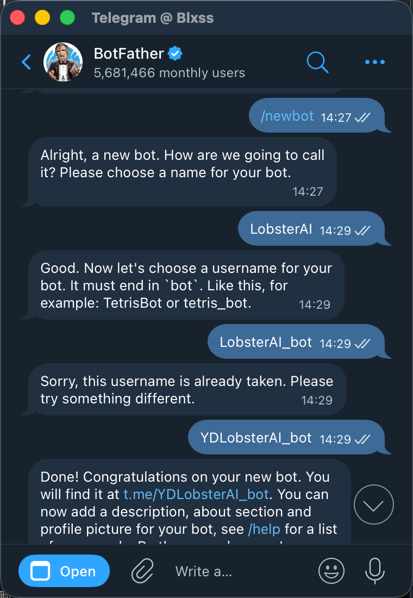

> **Tips**:
> * The Bot Name can be any text and supports multiple languages.
> * The Username must consist of English letters, numbers, and underscores, and must end with `bot`.
> * The Username must be unique; if prompted that it is already taken, you will need to choose another.
> 
> 

**3.3 Obtain Bot Token**

Once created successfully, BotFather will return a message containing the Token:

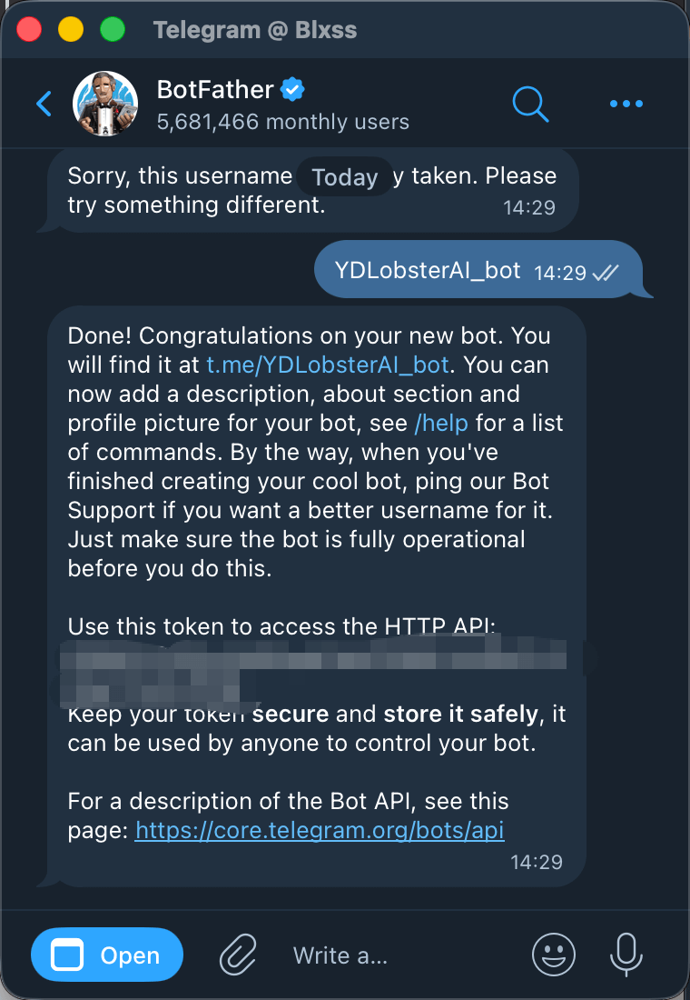

**⚠️ Copy and save this Token!** This is the identity credential for your bot, formatted like: `1234567890:ABCdefGHIjklMNOpqrsTUVwxyz1234567890`

> ⚠️ **Security Tip**: The Token acts as the bot's password. Do not share it with others! If it is accidentally leaked, you can generate a new one via the `/revoke` command.

---

#### Step 4: Enter the Token into the LobsterAI Client

Open the IM configuration interface in your LobsterAI client:

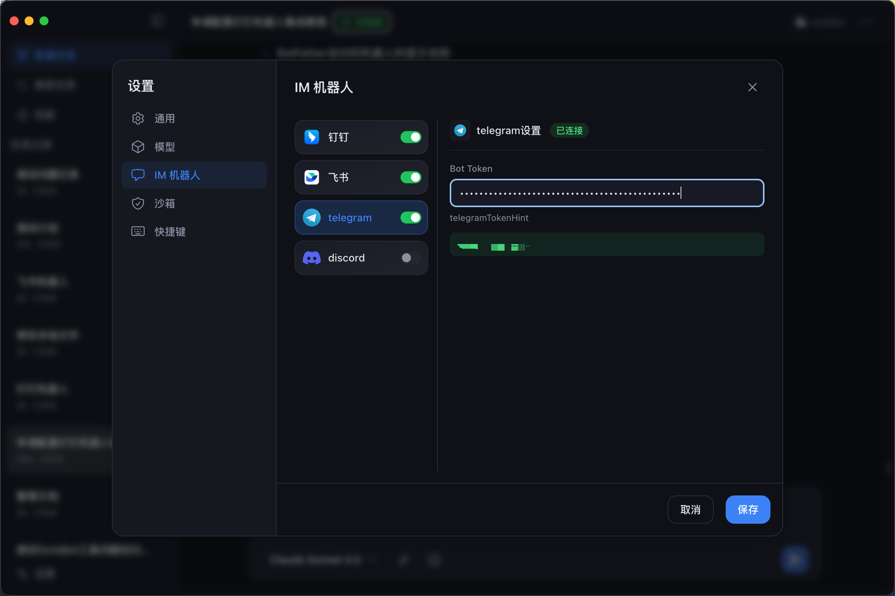

In the Telegram configuration section:

1. Paste the Token you copied above into the **Bot Token** input field.
2. Toggle the switch ON and confirm it shows a "Connected" status.

---

#### Step 5: Search for your bot in Telegram

Enter the bot username you just created (e.g., `@LobsterAI_bot`) in the Telegram search bar:

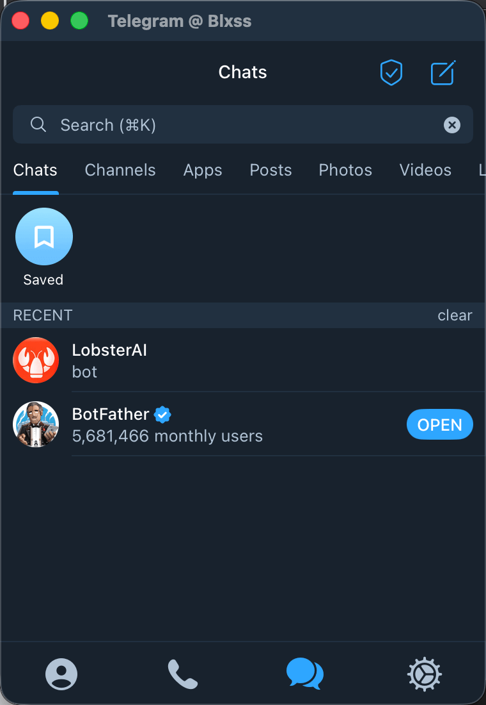

Click on the bot to enter the chat window.

---

#### Step 6: Send the /start command to begin the conversation

Send the `/start` command in the chat window to activate the bot. You can then begin chatting with the bot normally!

---

#### Step 7: (Optional) Customize Bot Appearance

You can further customize your bot via BotFather:

**Set Bot Profile Picture:**

* Send `/setuserpic` to BotFather
* Select your bot
* Upload an image

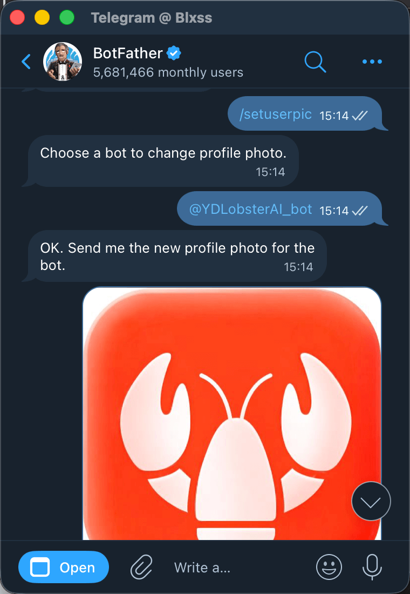

**Set Bot Description:**

* Send `/setdescription` to BotFather
* Select your bot
* Enter the description text

**Set Bot About Text:**

* Send `/setabouttext` to BotFather
* Select your bot
* Enter the introductory text

---

### ⚠️ Important Notes

* **Token Security**: Keep it safe. If leaked, regenerate it via `/revoke`.
* **Username Rules**: Must end with `bot` and only supports English letters, numbers, and underscores.
* **First Use**: You must send `/start` to activate the chat.

---

## Discord Bot Configuration

### Preparation

Before you begin, please ensure you have:

* ✅ A registered Discord account
* ✅ Created or managed at least one Discord Server

### Configuration Steps

#### Step 1: Create a Bot Application

Visit the Discord Developer Portal: [https://discord.com/developers/applications](https://discord.com/developers/applications) and log in with your Discord account.

Click the **New Application** button in the top right corner. In the pop-up dialog, enter your application name:

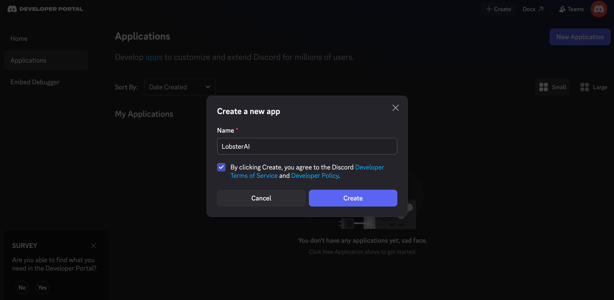

* **Application Name**: e.g., LobsterAI
* Check the box to agree to the terms of service.
* Click **Create**.

---

#### Step 2: Configure Bot Information

Once created, you will enter the application management page. Click the **Bot** option in the left menu. If a Bot hasn't been created yet, click the **Add Bot** button and confirm.

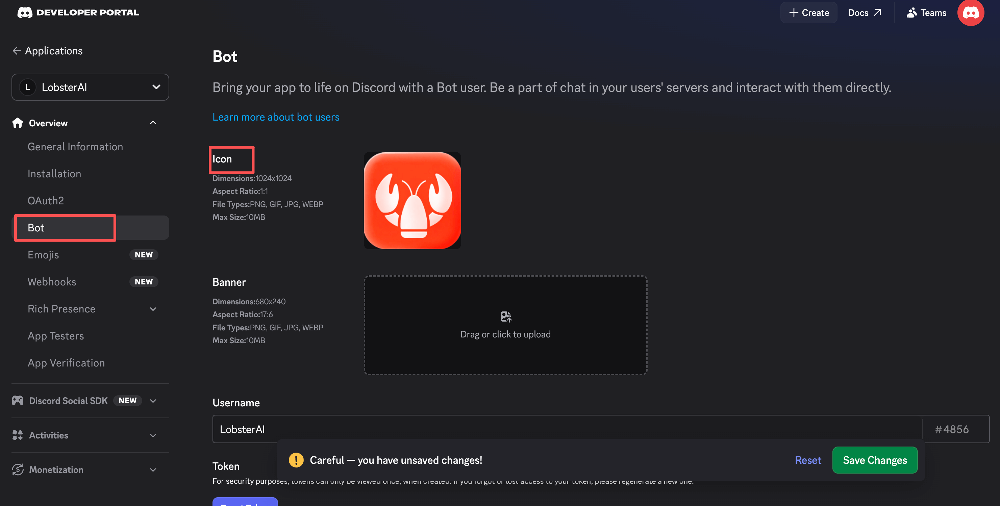

After creation, you will see the bot configuration page where you can:

* Set the bot profile picture
* Set the bot username
* View and reset the Token

---

#### Step 3: Obtain Bot Token

At the top of the Bot configuration page, find the **TOKEN** section. Click the **Reset Token** button (for first-time creation) or the **Copy** button.

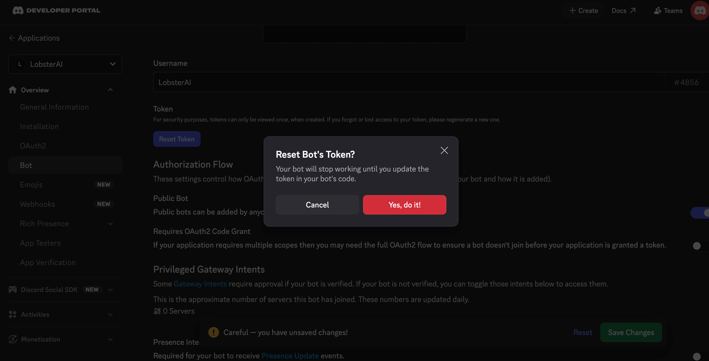

After confirming, the system will display the Token.

**⚠️ Copy and save this Token!** This is the identity credential for your bot, acting as the bot's "password."

> ⚠️ **Security Tip**:
> * The Token is only displayed once; please copy and save it immediately!
> * If lost, you can only generate a new Token.
> * Never share the Token with others, or they could control your bot.
> * If accidentally leaked, please regenerate a new Token immediately.
> 
> 

---

#### Step 4: Enter the Token into the LobsterAI Client

Open the IM configuration interface in your LobsterAI client. In the Discord configuration section, paste the Token you copied above into the **Bot Token** field:

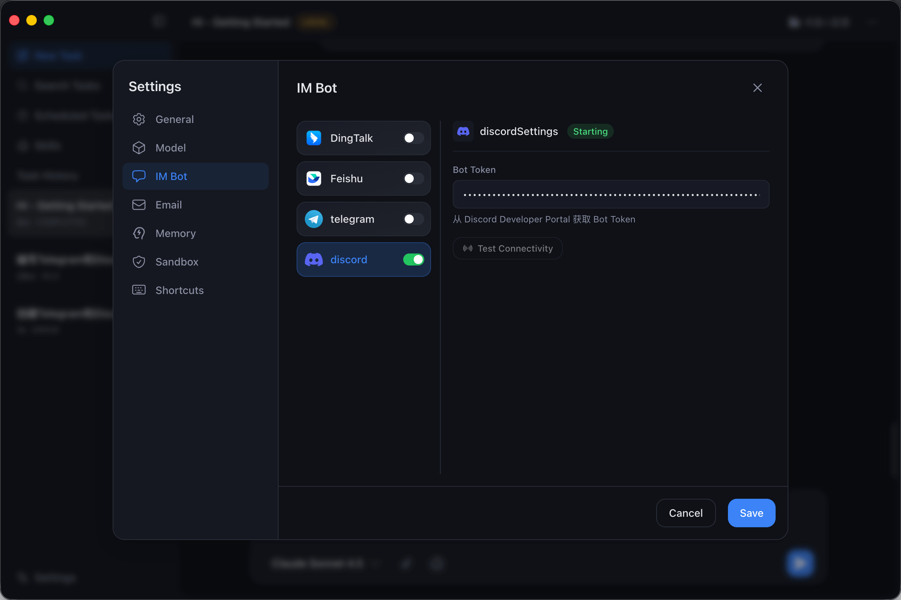

1. Paste the Token into the **Bot Token** input field.
2. Toggle the switch ON.

---

#### Step 5: Configure Bot Permissions

Scroll down on the Bot configuration page to find the **Privileged Gateway Intents** section.

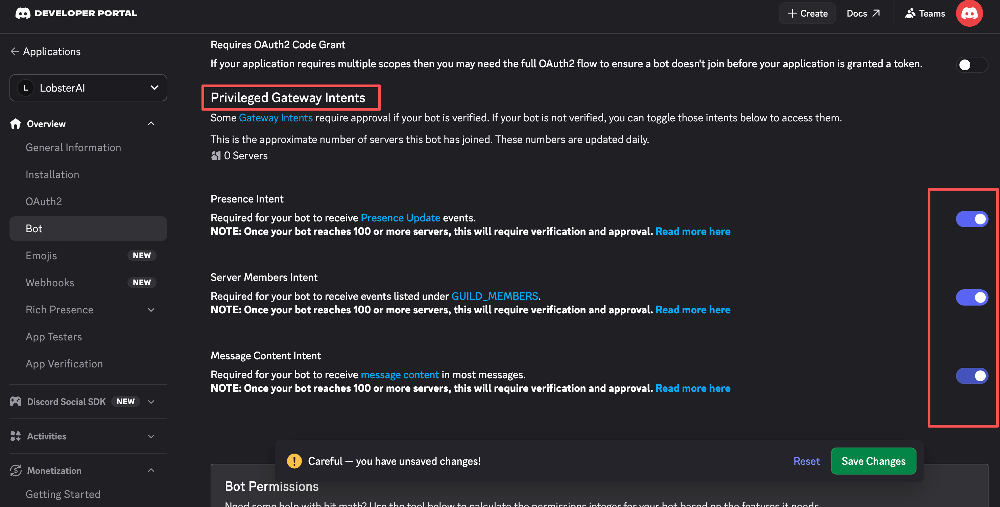

**You MUST enable the following intents:**

* ✅ **PRESENCE INTENT** - To get member online status
* ✅ **SERVER MEMBERS INTENT** - To get server member information
* ✅ **MESSAGE CONTENT INTENT** - To read message content

> ⚠️ **Important**: If you do not enable MESSAGE CONTENT INTENT, the bot will be unable to read the content of messages sent by users!

Remember to click **Save Changes** after enabling them.

---

#### Step 6: Generate Invitation Link and Invite Bot

Click the **OAuth2** option in the left menu:

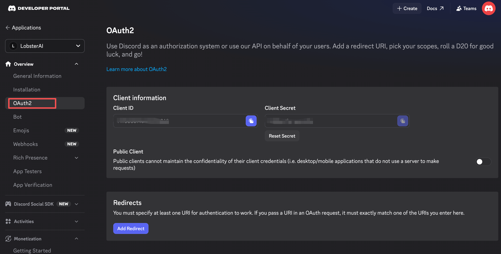

Then click **URL Generator**. In the **Scopes** section, check the following two options:

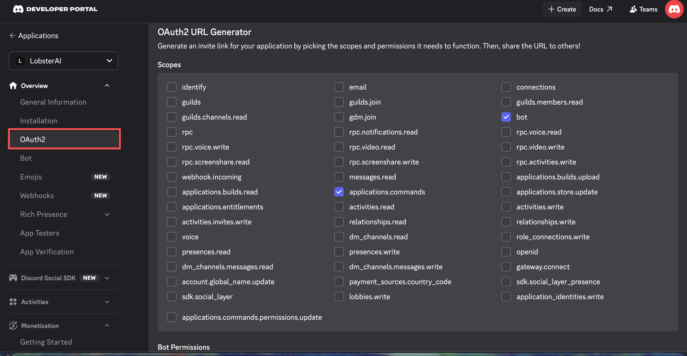

* ✅ **bot** - Basic bot permission, allowing the bot to join the server as a regular user.
* ✅ **applications.commands** - Slash command permission, allowing the bot to use Discord's slash command features (e.g., `/help`).

In the **Bot Permissions** section, check the following permissions:

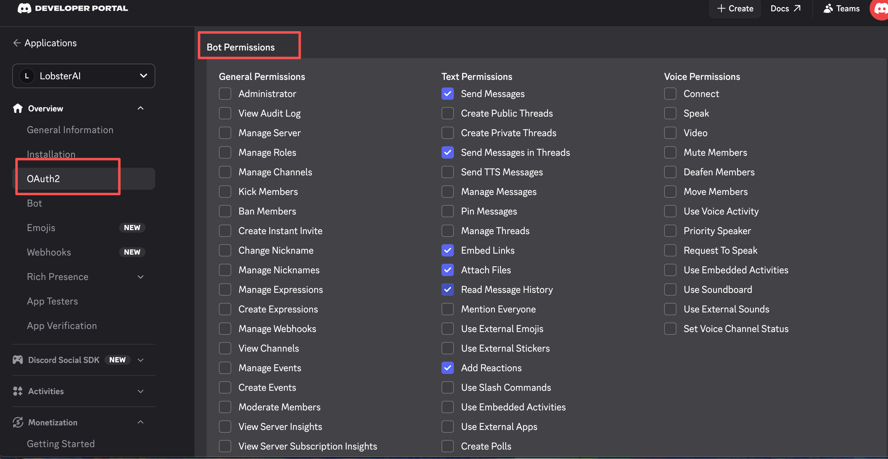

**Why these permissions are needed:**

* **Send Messages**: Basic ability for the bot to reply to users.
* **Send Messages in Threads**: Supports conversations within Discord threads.
* **Embed Links**: Displays rich text link previews.
* **Attach Files**: Sends images, documents, and other files.
* **Read Message History**: Allows the bot to view channel history to understand conversation context.
* **Add Reactions**: Uses emojis to react to user messages.
* **View Channels**: Allows the bot to see the list of channels in the server.

> 💡 **Tip**: These are the minimum permissions required for the LobsterAI bot to function normally. You can adjust permissions based on your specific needs.

Copy the invitation link automatically generated at the bottom of the page, paste it into your browser's address bar, and select the server you want to add the bot to:

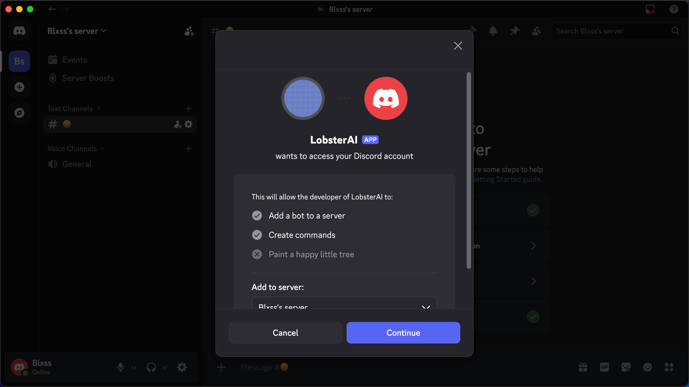

* Select the server you manage from the dropdown menu.
* Click **Continue**.
* Confirm the permissions and click **Authorize**.

> ⚠️ **Note**: You must have Administrator permissions on the server to add a bot.

Once authorized, the bot will appear in the server's member list.

---

#### Step 7: Test the Bot

In any text channel of your Discord server, @mention your bot and send a message. The bot should reply to you.

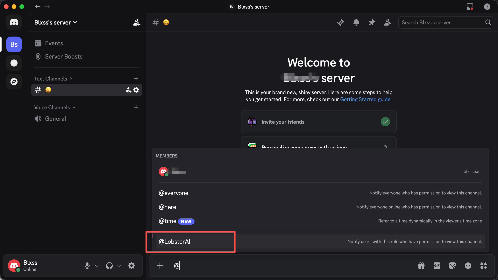

> **Tip**: In Discord, the bot will only respond to messages that @mention it, unless other triggers are configured in the code.

---

### ⚠️ Important Notes

* **MESSAGE CONTENT INTENT**: This must be enabled to read messages.
* **Basic Permissions**: Ensure the bot has permissions to View Channels, Send Messages, and Read Message History.
* **Trigger Method**: By default, an @mention is required for the bot to respond.

---

## FAQ

### Telegram

**Q: "Connection Failed" error after entering the Token?**

* Check if the Token was copied completely.
* Confirm whether your network can access the Telegram API.
* Try regenerating the Token via `/revoke`.

**Q: Bot is not receiving messages?**

* Confirm the user has sent `/start` to activate the bot.
* Check if the client shows a "Connected" status.

---

### Discord

**Q: Bot is not receiving user messages?**

1. Check if the **MESSAGE CONTENT INTENT** is enabled (Bot Settings → Privileged Gateway Intents).
2. Check channel permissions: View Channel, Send Messages, Read Message History.

**Q: Bot appears offline?**

* Check if the Token was entered correctly.
* Confirm the client shows a "Connected" status.
* Restart the LobsterAI client.
