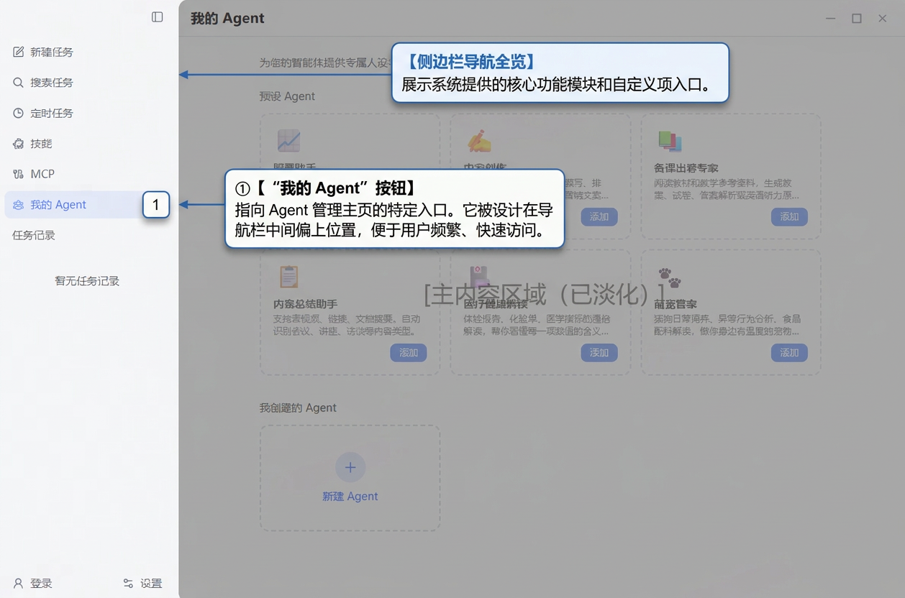
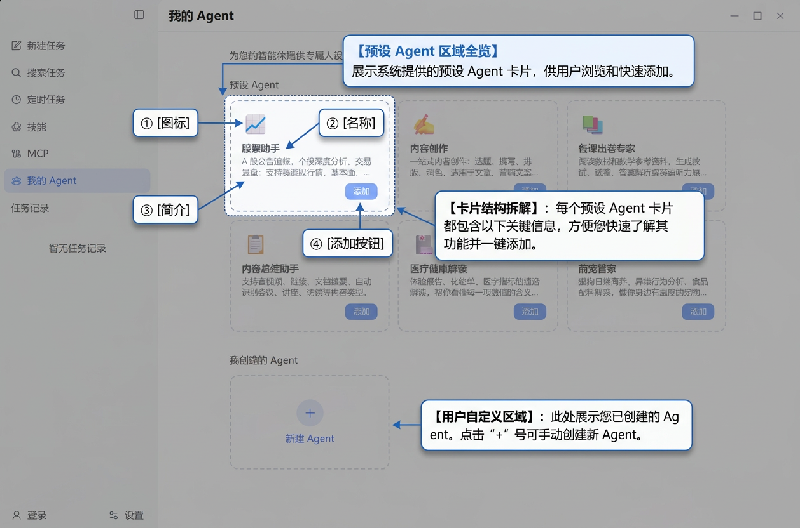
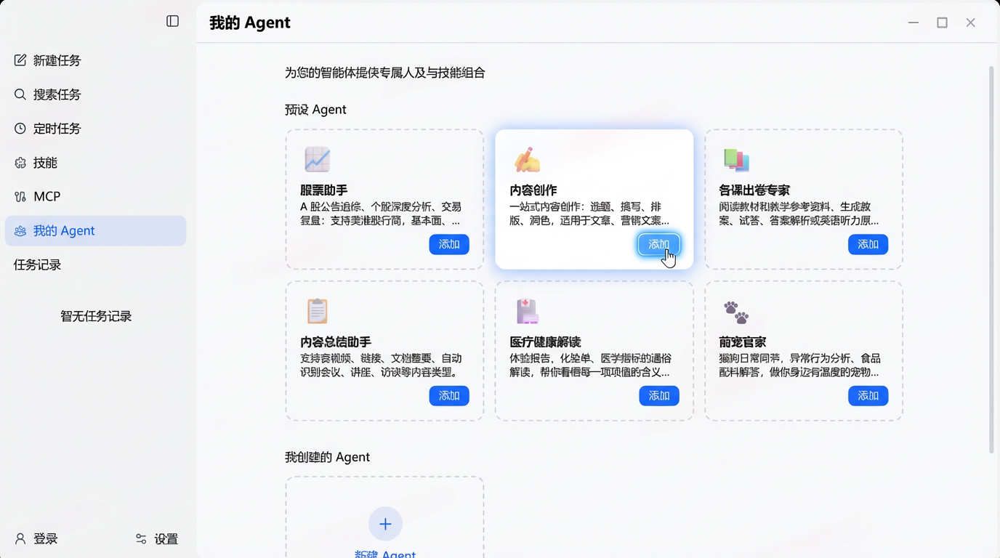
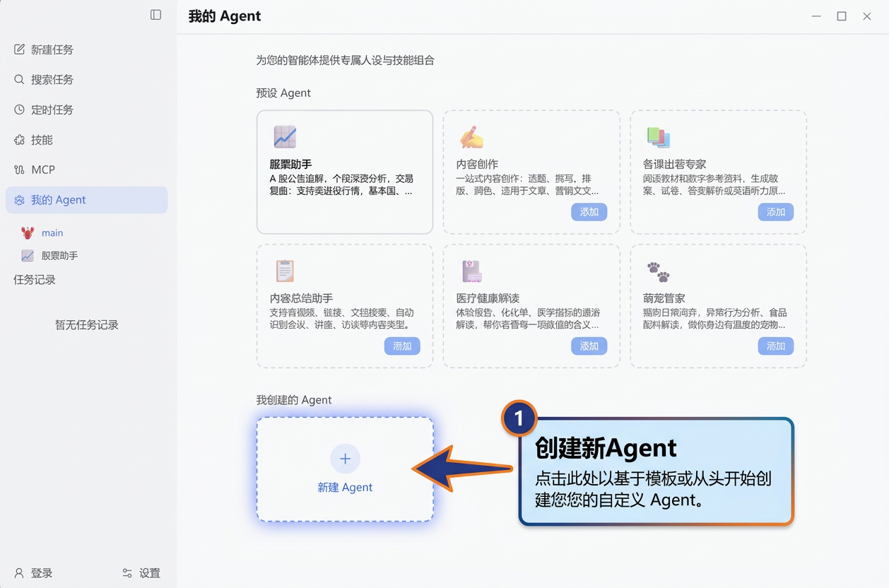
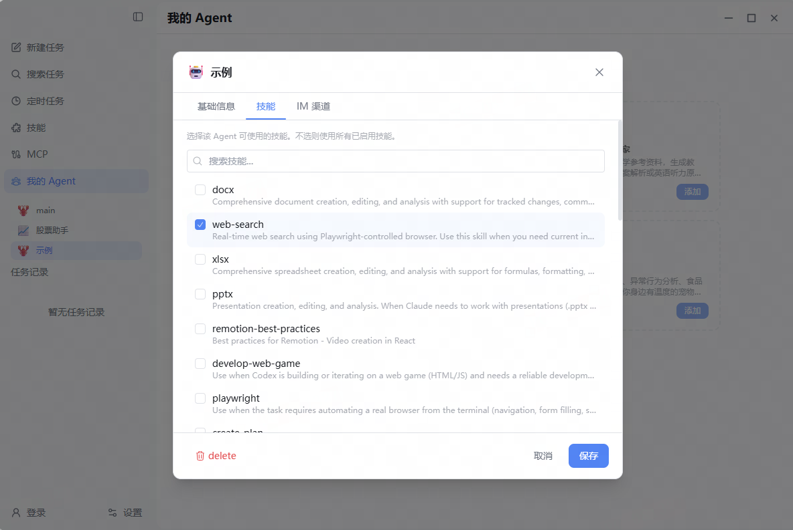
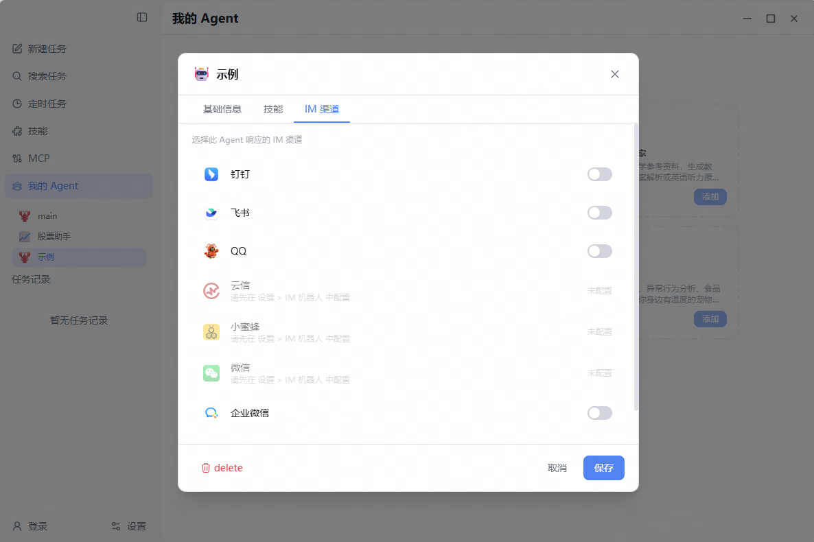
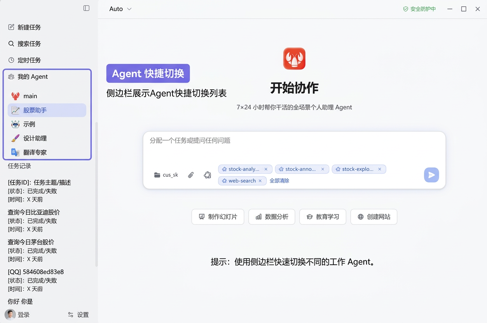

## Prerequisites

Before starting, please ensure:
- ✅ LobsterAI is upgraded to **version 2026.3.26** or above
- ✅ At least one AI model is configured and available

---

## Entering the Agent Management Page

### Method 1: Sidebar Entry

In LobsterAI's left sidebar, click the **"My Agents"** button (user group icon) to enter the Agent management page.

---

## Using Preset Agents

LobsterAI comes with multiple carefully tuned preset Agent templates that are ready to use out of the box.

### Viewing Preset Agents

After entering the Agent management page, you can see the **"Preset Agents"** section, which displays all available preset templates:

**Currently Built-in Preset Agents:**

| Icon | Name | Description |
|------|------|-------------|
| 📈 | Stock Assistant | A-share announcement tracking, in-depth stock analysis, trading review; supports US/Hong Kong stock market data, fundamentals, technical indicators, and risk assessment |
| ✍️ | Content Creator | One-stop content creation: topic selection, writing, formatting, polishing; suitable for articles, marketing copy, and social media posts |
| 📚 | Lesson & Exam Expert | Read teaching materials and references, generate lesson plans, exam papers, answer keys, or English listening transcripts |
| 📋 | Content Summarizer | Supports audio/video, links, and document summaries; automatically identifies content types such as meetings, lectures, and interviews |
| 🏥 | Health Report Interpreter | Plain-language interpretation of physical examination reports, lab test results, and medical indicators; helps you understand the meaning of each value and precautions |
| 🐾 | Pet Care Companion | Daily cat and dog care, abnormal behavior analysis, pet food ingredient interpretation; your caring pet encyclopedia |

### Adding a Preset Agent

#### Step 1: Select a Preset Template

In the Preset Agents section, find the Agent you're interested in and click the **"Add"** button on the card:

#### Step 2: Agent Ready

After successful addition, the Agent will appear in the Agent list in the left sidebar and will automatically switch to the currently active Agent. You can start chatting right away!

---

## Creating a Custom Agent

In addition to using preset templates, you can also create a fully customized Agent from scratch.

### Step 1: Open the Create Dialog

In the **"My Created Agents"** section on the Agent management page, click the **"New Agent"** card (the blank card with a + icon):

### Step 2: Fill in Basic Information

In the settings dialog that pops up, fill in the following information:

- **Icon**: Click the icon area to select an emoji as the Agent's avatar
- **Name** (required): Give your Agent a distinctive name
- **Description** (optional): A one-sentence introduction to the Agent's purpose
- **System Prompt**: Defines the Agent's role, capabilities, and behavioral guidelines (this is the most critical configuration)
- **Identity** (optional): Identity description (IDENTITY.md), used for more refined personality definition
- **Skill Selection**: Switch to the "Skills" tab and check the skills you want this Agent to use from the list of enabled skills

> **About System Prompts**: The system prompt determines the Agent's "persona" and capability boundaries. A good system prompt should clearly state: the Agent's role positioning, core capabilities, workflow, output format, and precautions. You can refer to the prompt writing style of preset Agents.

### Step 3: Confirm Creation

Click the **"Save"** button, and the new Agent will be created and automatically switched to the currently active Agent. You can start chatting immediately.

---

## Configuring and Managing Agents

### Entering Agent Settings

On the Agent management page, click on any added Agent card to open the **Settings Panel** for that Agent.

The settings panel is divided into three tabs: **Basic Info**, **Skills**, and **IM Channels**.

---

### Tab 1: Basic Information

In the **"Basic Info"** tab, you can edit:

- **Icon + Name**: Modify the Agent's display name and emoji icon
- **Description**: Update the Agent's introduction
- **System Prompt**: Adjust the Agent's role settings and behavioral guidelines
- **Identity** (Advanced): Identity description (IDENTITY.md), used for more refined personality definition

---

### Tab 2: Skill Configuration

In the **"Skills"** tab, you can select available skills for the Agent:

- Displays a list of all enabled skills
- Quickly find skills using the search box
- Check the skills the Agent needs to use

> **Tip**: Select a skill combination relevant to the Agent's responsibilities to keep it focused. For example, "Stock Assistant" can keep only stock analysis and web search related skills, without loading unrelated skills like document editing.

---

### Tab 3: IM Channel Binding

In the **"IM Channels"** tab, you can bind the Agent to a specific IM platform:

**Supported Platforms:**
- DingTalk
- Feishu/Lark
- QQ (QQ-BOT)
- WeChat
- WeCom (WeChat Work)
- etc.

**Binding Rules:**
- Each IM platform can only be bound to one Agent at a time
- After binding, all messages received on that platform will be handled by the corresponding Agent
- Unbound platforms will default to using the "Main Agent" to handle messages
- You need to complete the basic configuration for the corresponding platform in **Settings → IM Configuration** (fill in credential information) before you can bind here

> **Usage Example**: Bind "Stock Assistant" to DingTalk and "Content Creator" to Feishu. This way, when asking the bot stock questions through DingTalk, "Stock Assistant" will automatically respond; when consulting on content creation through Feishu, the "Content Creator" Agent will respond.

---

### Saving Settings

After making changes, click the **"Save"** button at the bottom of the panel to save all changes.

---

### Deleting an Agent

At the bottom of the settings panel, click the red **"Delete"** button to delete the current Agent:

- Secondary confirmation is required before deletion
- After deletion, the Agent's IM bindings will be automatically cleared
- The Agent's conversation history will not be deleted
- **Main Agent (Main) cannot be deleted**

> ⚠️ **Note**: Deletion is irreversible! If you only need to temporarily stop using it, it's recommended to keep it rather than delete it.

---

## Switching Agents

You can switch between different Agents in the following ways:

### Method 1: Sidebar Quick Switch

The top of the sidebar displays the currently active Agent's name and icon. Click to expand the Agent list and select the Agent you want to switch to:

### Method 2: Agent Management Page

Enter the Agent management page, click on the target Agent card to open the settings panel, then click the **"Use This Agent"** button to switch.

**What happens after switching:**
- The sidebar conversation list automatically refreshes to that Agent's conversation records
- New conversations will be associated with the current Agent
- The Agent's skill set is automatically loaded

---

## Conversation and Agent Relationship

Every conversation (Session) belongs to the Agent selected at creation time:

- New conversations initiated under a certain Agent are automatically associated with that Agent
- After switching Agents, the sidebar only displays the current Agent's conversation history
- Conversations from different Agents do not interfere with each other; data is completely isolated
- The Agent association relationship at conversation creation time cannot be changed

---

## Main Agent

LobsterAI always has a **Main Agent**, which is the system's default Agent:

- **Cannot be deleted**: Main Agent always exists
- **Default fallback**: Messages from IM platforms without a dedicated Agent bound are handled by the Main Agent
- **Full skills**: Main Agent can use all enabled skills by default
- **Initial state**: When using LobsterAI for the first time, all conversations belong to the Main Agent

> **Understanding Main Agent**: You can think of the Main Agent as a "general assistant". Dedicated Agents are responsible for specific domains, while the Main Agent handles all other requests as a fallback.

---

## Complete Usage Example

Here is a typical multi-Agent configuration workflow:

### Scenario: Configuring dedicated assistants for different purposes

**Goal**: Hand over the DingTalk bot to the "Stock Assistant" and the Feishu bot to the "Content Creator".

#### 1. Add "Stock Assistant" Preset

Enter the Agent management page → Find "📈 Stock Assistant" in Preset Agents → Click "Add"

#### 2. Add "Content Creator" Preset

Continue to find "✍️ Content Creator" in Preset Agents → Click "Add"

#### 3. Bind IM Channels

- Click "Stock Assistant" card → Switch to "IM Channels" tab → Turn on "DingTalk" switch → Save
- Click "Content Creator" card → Switch to "IM Channels" tab → Turn on "Feishu" switch → Save

#### 4. Test Results

- Send a message to the bot on DingTalk: "Help me analyze CATL's recent trend" → Stock Assistant responds
- Send a message to the bot on Feishu: "Help me write a WeChat article about AI" → Content Creator Agent responds
- Direct conversation in LobsterAI client → Uses the currently selected Agent

---

## FAQ

**Q: Is there a limit to the number of Agents I can create?**

A: There is no hard limit. You can create any number of Agents as needed. However, it is recommended to plan reasonably based on actual usage scenarios to avoid creating too many idle Agents.

---

**Q: Can different Agents use different AI models?**

A: Currently, all Agents share the same model configuration. The differences between Agents are reflected in system prompts and skill configurations.

---

**Q: Will conversation records be lost after deleting an Agent?**

A: No. After an Agent is deleted, its historical conversation records remain in the database.

---

**Q: Can the system prompt of a preset Agent be modified?**

A: Yes. After a preset Agent is added, it becomes your Agent instance. You can freely modify the system prompt, skills, and other configurations in the settings panel.

---

**Q: Can one IM platform be bound to multiple Agents?**

A: No. Each IM platform can only be bound to one Agent at a time. If you need to switch, please modify the binding relationship in the settings.

---

**Q: Can I use Agents normally without binding IM channels?**

A: Of course. IM binding is an optional feature. You can directly switch Agents in the LobsterAI client and have conversations without any IM configuration.

---

**Q: How can I make an Agent available in multiple IM groups?**

A: Agents are bound to IM platforms, not individual conversations. After binding, messages on that platform will be handled by the corresponding Agent. The prerequisite is that the IM bot has been configured (for specific configuration methods, please refer to the [IM Bot Configuration Guide](LobsterAI-IM-Bot-Configuration-Guide.md)).

---

## Best Practices

1. **Start with presets**: Try preset Agents first to understand their effects, then modify or create custom Agents as needed
2. **Streamline skills**: Select only the necessary skills for each Agent to reduce interference and improve response quality
3. **Reasonable division of labor**: Divide Agents by domain to avoid a single Agent taking on too many roles
4. **Make good use of IM binding**: Bind different domain Agents to corresponding IM platforms for automatic traffic distribution
5. **Iteratively optimize prompts**: System prompts are the soul of an Agent; test and adjust more to find the best effect
