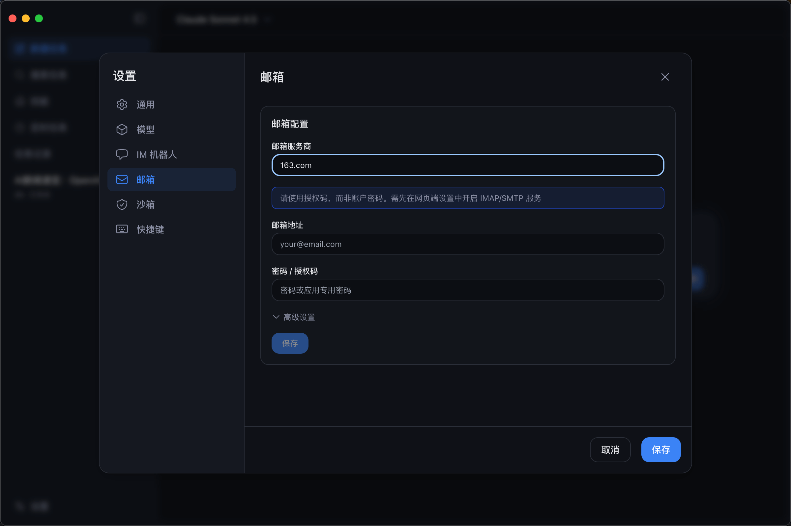
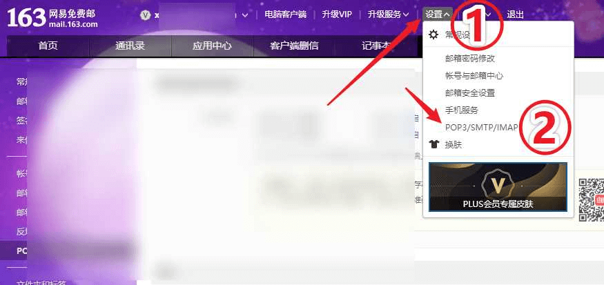
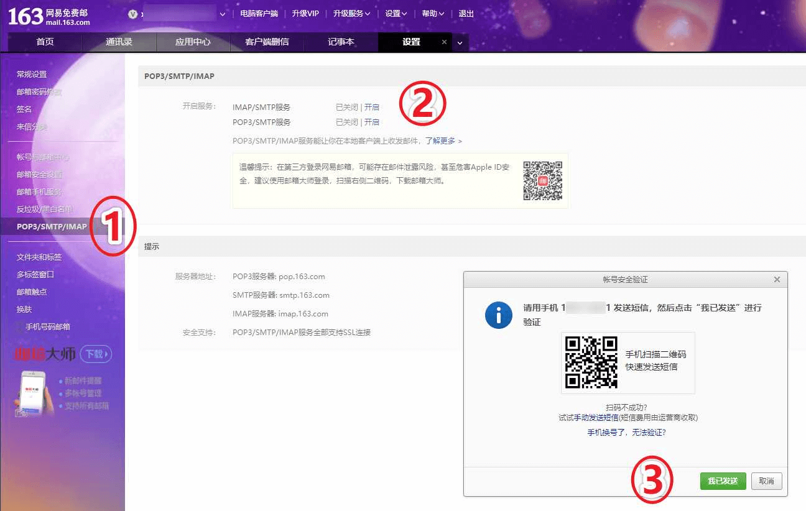
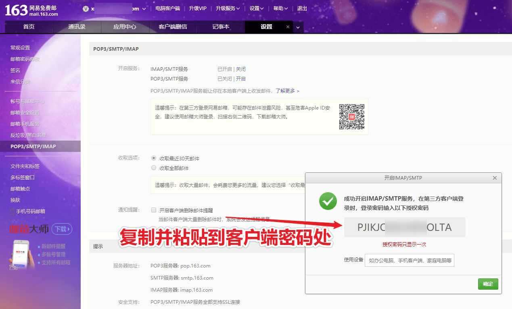

---
id: email_config_guide
title: "邮箱配置指南"
locale: zh-CN
route: /docs/email_config_guide
source_url: "https://lobsterai.youdao.com/#/docs/email_config_guide"
source_chunk: "https://shared.ydstatic.com/market/souti/fihserChatWeb/online/2.0.4/dist/assets/LobsterAI-%E9%82%AE%E7%AE%B1%E9%85%8D%E7%BD%AE%E6%8C%87%E5%8D%97-DWCWXXfT.js"
---# LobsterAI 邮箱配置指南

需要填写邮箱地址和授权码， 以 163 邮箱 为例子。

授权码获取方式：

浏览器登录 mail.163.com (126邮箱：mail.126.com) ，点击路径：“设置” >> “POP3/SMTP/IMAP” 。

在右边网页中，选择“开启”（IMAP/SMTP服务），弹出“帐号安全验证”

验证后获取客户端授权密码

