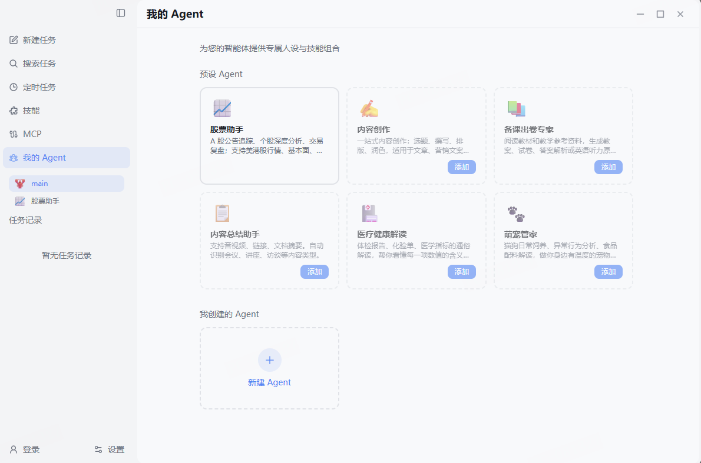
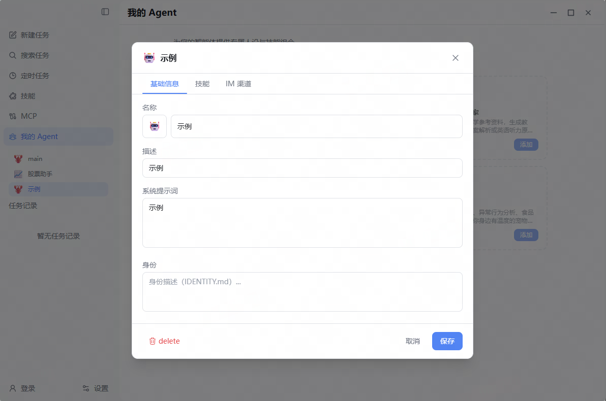
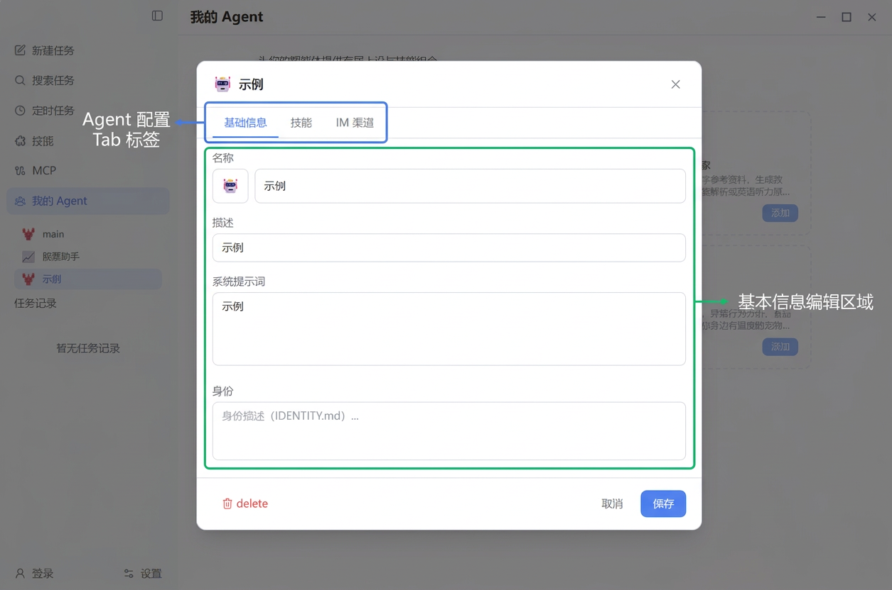
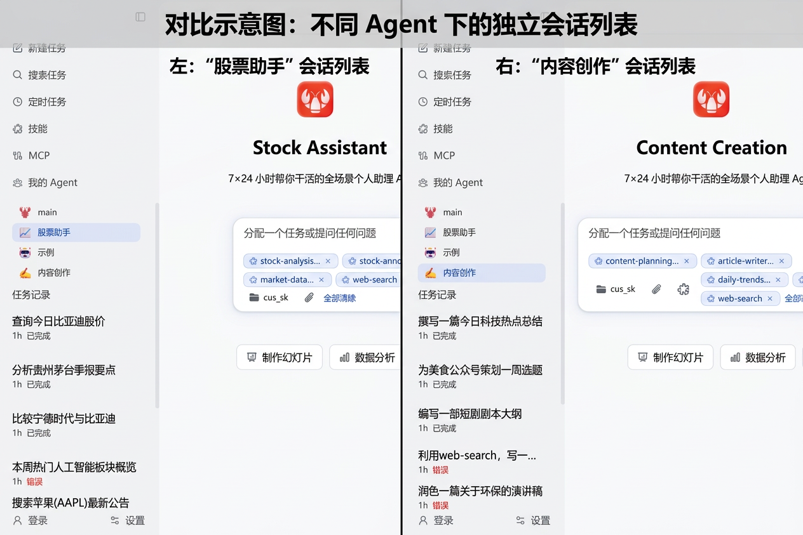

## 准备工作

在开始之前，请确保：
- ✅ LobsterAI 已升级到 **2026.3.26 版本**及以上
- ✅ 已配置至少一个可用的 AI 模型

---

## 进入 Agent 管理页面

### 方式一：侧边栏入口

在 LobsterAI 左侧边栏，点击 **「我的 Agent」** 按钮（用户组图标），即可进入 Agent 管理页面。

---

## 使用预设 Agent

LobsterAI 内置了多个精心调教的预设 Agent 模板，开箱即用。

### 查看预设 Agent

进入 Agent 管理页面后，可以看到 **「预设 Agent」** 区域，展示所有可用的预设模板：

**当前内置的预设 Agent：**

| 图标 | 名称 | 说明 |
|------|------|------|
| 📈 | 股票助手 | A 股公告追踪、个股深度分析、交易复盘；支持美港股行情、基本面、技术指标与风险评估 |
| ✍️ | 内容创作 | 一站式内容创作：选题、撰写、排版、润色，适用于文章、营销文案和社交媒体帖子 |
| 📚 | 备课出卷专家 | 阅读教材和教学参考资料，生成教案、试卷、答案解析或英语听力原文 |
| 📋 | 内容总结助手 | 支持音视频、链接、文档摘要，自动识别会议、讲座、访谈等内容类型 |
| 🏥 | 医疗健康解读 | 体检报告、化验单、医学指标的通俗解读，帮你看懂每一项数值的含义和注意事项 |
| 🐾 | 萌宠管家 | 猫狗日常饲养、异常行为分析、食品配料解读，做你身边有温度的宠物百科 |

### 添加预设 Agent

#### 步骤 1：选择预设模板

在预设 Agent 区域，找到你感兴趣的 Agent，点击卡片上的 **「添加」** 按钮：

#### 步骤 2：Agent 已就绪

添加成功后，该 Agent 会出现在左侧边栏的 Agent 列表中，并自动切换为当前活跃的 Agent。你可以直接开始对话！

---

## 创建自定义 Agent

除了使用预设模板，你还可以从零开始创建完全自定义的 Agent。

### 步骤 1：打开创建对话框

在 Agent 管理页面的 **「我创建的 Agent」** 区域，点击 **「新建 Agent」** 卡片（带 + 号的空白卡片）：

### 步骤 2：填写基本信息

在弹出的设置对话框中，填写以下信息：

- **图标**：点击图标区域，选择一个 emoji 作为 Agent 的头像
- **名称**（必填）：给你的 Agent 起一个有辨识度的名字
- **描述**（可选）：一句话介绍 Agent 的用途
- **系统提示词**：定义 Agent 的角色、能力和行为规范（这是最关键的配置项）
- **身份**（可选）：身份描述（IDENTITY.md），用于更精细的人格定义
- **Agent 默认模型**（必选）：下拉选择agent默认的模型。
- **技能选择**：切换到「技能」标签页，从已启用的技能列表中勾选该 Agent 可以使用的技能
- **IM渠道**（可选）：选择此 Agent 响应的 IM 渠道，单个agent可选择一个或多个渠道

> **关于系统提示词**: 系统提示词决定了 Agent 的"人设"和能力边界。一个好的系统提示词应该明确说明：Agent 的角色定位、核心能力、工作流程、输出格式以及注意事项。可以参考预设 Agent 的提示词写法。

### 步骤 3：确认创建

点击 **「保存」** 按钮，新的 Agent 将被创建并自动切换为当前活跃 Agent，你可以立即开始对话。

---

## 配置和管理 Agent

### 进入 Agent 设置

在 Agent 管理页面中，点击任意一个已添加的 Agent 卡片，即可打开该 Agent 的 **设置面板**。

设置面板分为三个标签页：**基础信息**、**技能**、**IM 渠道**。

---

### 标签页一：基础信息

在 **「基础信息」** 标签页中，你可以编辑：

- **图标 + 名称**：修改 Agent 的显示名称和 emoji 图标
- **描述**：更新 Agent 的简介
- **系统提示词**：调整 Agent 的角色设定和行为规范
- **身份**（高级）：身份描述（IDENTITY.md），用于更精细的人格定义
- **Agent 默认模型**：下拉选择修改agent默认的模型。

---

### 标签页二：技能配置

在 **「技能」** 标签页中，你可以为 Agent 选择可用的技能：

- 展示所有已启用的技能列表
- 通过搜索框快速查找技能
- 勾选 Agent 需要使用的技能

> **技巧**: 为 Agent 选择与其职责相关的技能组合，可以让它更专注。比如「股票助手」可以只保留股票分析和网络搜索相关技能，而不必加载文档编辑等无关技能。

---

### 标签页三：IM 渠道绑定

在 **「IM 渠道」** 标签页中，你可以将 Agent 绑定到特定的 IM 平台：

**支持绑定的平台：**
- 钉钉 (DingTalk)
- 飞书 (Feishu/Lark)
- QQ (QQ-BOT)
- 微信 (WeChat)
- 企业微信 (WeCom)
- 等

**绑定规则：**
- 目前钉钉、飞书、QQ可以通过创建多个实例，绑定多个Agent。微信、企业微信、云信、小蜜蜂、POPO仅可绑定一个Agent
- 绑定后，该平台收到的所有消息将交由对应 Agent 处理
- 未绑定的特定agent的平台默认使用「主 Agent」（Main Agent）处理消息
- 需要先在 **设置 → IM 配置** 中完成对应平台的基础配置（填写凭证信息），才能在此处进行绑定

> **使用场景示例**: 1、将「股票助手」绑定到钉钉，将「内容创作」绑定到飞书。这样通过钉钉向机器人提问股票问题时，会自动由「股票助手」回答；通过飞书咨询内容创作，则由「内容创作」Agent 响应。  2、将「股票助手」绑定到飞书的机器人1，将「内容创作」绑定到飞书的机器人2。这样通过飞书向机器人1提问股票问题时，会自动由「股票助手」回答；通过飞书向机器人2咨询内容创作，则由「内容创作」Agent 响应。

---

### 保存设置

修改完成后，点击面板底部的 **「保存」** 按钮即可保存所有更改。

---

### 删除 Agent

在设置面板底部，点击红色的 **「删除」** 按钮可以删除当前 Agent：

- 删除前需要二次确认
- 删除后，该 Agent 的 IM 绑定将自动清除
- 该 Agent 的对话历史不会被删除
- **主 Agent（Main）不可删除**

> ⚠️ **注意**: 删除操作不可撤销！如果只是暂时不用，建议保留而非删除。

---

## 切换 Agent

你可以通过以下方式在不同 Agent 之间切换：

### 方式一：侧边栏快捷切换

侧边栏顶部会显示当前活跃的 Agent 名称和图标。点击可展开 Agent 列表，选择要切换的 Agent：

### 方式二：Agent 管理页面

进入 Agent 管理页面，点击目标 Agent 卡片打开设置面板，然后点击 **「使用此 Agent」** 按钮进行切换。

**切换后会发生什么：**
- 侧边栏会话列表自动刷新为该 Agent 的对话记录
- 新建对话将关联到当前 Agent
- Agent 的技能集合自动加载

---

## 对话与 Agent 的关系

每一次对话（Session）都归属于创建时所选的 Agent：

- 在某个 Agent 下发起的新对话，自动关联到该 Agent
- 切换 Agent 后，侧边栏只显示当前 Agent 的对话历史
- 不同 Agent 的对话互不干扰，数据完全隔离
- 对话创建时的 Agent 关联关系不可更改

---

## 主 Agent（Main Agent）

LobsterAI 始终存在一个 **主 Agent**，它是系统的默认 Agent：

- **不可删除**：主 Agent 始终存在
- **默认回退**：未绑定专属 Agent 的 IM 平台，消息由主 Agent 处理
- **全量技能**：主 Agent 默认可以使用所有已启用的技能
- **初始状态**：首次使用 LobsterAI 时，所有对话都归属于主 Agent

> **理解主 Agent**: 你可以把主 Agent 想象成"通用助手"。专属 Agent 负责特定领域，主 Agent 负责兜底处理所有其他请求。

---

## 完整使用示例

以下是一个典型的多 Agent 配置流程：

### 场景：为不同用途配置专属助手

**目标**: 将钉钉的机器人交给「股票助手」处理，飞书的机器人交给「内容创作」处理。

#### 1. 添加「股票助手」预设

进入 Agent 管理页面 → 在预设 Agent 中找到「📈 股票助手」 → 点击「添加」

#### 2. 添加「内容创作」预设

继续在预设 Agent 中找到「✍️ 内容创作」 → 点击「添加」

#### 3. 绑定 IM 渠道

- 点击「股票助手」卡片 → 切换到「IM 渠道」标签 → 打开「钉钉」开关 → 保存
- 点击「内容创作」卡片 → 切换到「IM 渠道」标签 → 打开「飞书」开关 → 保存

#### 4. 测试效果

- 在钉钉上向机器人发消息："帮我分析一下宁德时代最近走势" → 股票助手响应
- 在飞书上向机器人发消息："帮我写一篇关于 AI 的公众号文章" → 内容创作 Agent 响应
- 在 LobsterAI 客户端直接对话 → 使用当前选中的 Agent

---

## 常见问题

**Q: 创建 Agent 的数量有限制吗？**

A: 没有硬性限制，你可以根据需要创建任意数量的 Agent。但建议根据实际使用场景合理规划，避免创建过多闲置 Agent。

---

**Q: 不同 Agent 可以使用不同的 AI 模型吗？**

A: 可以。不同的agent在创建时可以选择不同的模型，同时可以在[我的agent]->[我创建的 Agent]->[基础信息]中进行修改。

---

**Q: 删除 Agent 后对话记录会丢失吗？**

A: 不会。Agent 被删除后，其历史对话记录仍然保留在数据库中。

---

**Q: 预设 Agent 的系统提示词可以修改吗？**

A: 可以。预设 Agent 添加后就变成了你的 Agent 实例，你可以在设置面板中自由修改系统提示词、技能和其他配置。

---

**Q: 一个 IM 平台可以绑定多个 Agent 吗？**

A: 可以。目前钉钉、飞书、QQ可以通过创建多个实例，绑定多个agent。微信、企业微信、云信、小蜜蜂、POPO仅可绑定一个agent

---

**Q: 不绑定 IM 渠道也能正常使用 Agent 吗？**

A: 当然可以。IM 绑定是可选功能。你可以直接在 LobsterAI 客户端中切换 Agent 并进行对话，完全不需要配置 IM。

---

**Q: 如何让 Agent 在多个 IM 群里都能用？**

A: Agent 绑定的是 IM 平台，不是单个会话。绑定后，该平台上的消息都会由对应 Agent 处理。前提是 IM 机器人已配置完成（具体配置方法请参考 [IM 机器人配置指南](LobsterAI-IM机器人配置指南.md)）。

---

## 最佳实践

1. **从预设开始**: 先试用预设 Agent，了解效果后再根据需要修改或创建自定义 Agent
2. **精简技能**: 为每个 Agent 只选择需要的技能，减少干扰，提升回复质量
3. **合理分工**: 按领域划分 Agent，避免一个 Agent 承担过多角色
4. **善用 IM 绑定**: 将不同领域的 Agent 绑定到对应的 IM 平台，实现自动分流
5. **迭代优化提示词**: 系统提示词是 Agent 的灵魂，多测试、多调整，找到最佳效果
